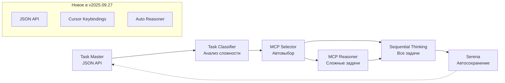

# ПРАВИЛА ИНТЕГРАЦИИ WORKFLOW: Task Master → Sequential Thinking → Serena

## 🎯 НАЗНАЧЕНИЕ

Определяет обязательный workflow для работы с задачами через последовательную интеграцию инструментов, обеспечивающую максимальную эффективность и автоматизацию.

---

## 🔄 АРХИТЕКТУРА WORKFLOW

### **Принцип цепочки инструментов с автоматическим выбором MCP**



### **🆕 РАСШИРЕННАЯ АРХИТЕКТУРА С ИНТЕЛЛЕКТУАЛЬНЫМ ВЫБОРОМ MCP**

### **Роли инструментов**

| Инструмент | Роль | Автоматизация | Новое в v0.26.0+ |
|------------|------|---------------|-------------------|
| **Task Master** | Структурирование и управление задачами | JSON API + Cursor keybindings | ✅ --json флаг |
| **MCP Reasoner** | Глубокий анализ сложных задач | Автовыбор по complexity >= 3 | ✅ MCTS/Beam Search |
| **Sequential Thinking** | Анализ и решение для всех задач | Автоматический вызов | ✅ Reasoner интеграция |
| **Serena** | Фоновое сохранение контекста | Автоматическая запись | ✅ JSON метаданные |

---

## 📥 ЭТАП 1: Task Master (Обязательная точка входа)

### **ПРАВИЛО**: ВСЕ задачи начинаются с Task Master

#### **Получение задачи (JSON API)**
```bash
# ОБЯЗАТЕЛЬНО выполнить перед началом работы
cd claude-task-master

# Для BSL задач: подготовить BSL Semantic Diff
BSL_DIFF_READY=true

# Основные команды с JSON выводом
npx task-master next --json              # Получить следующую задачу (JSON)
npx task-master show <id> --json         # Просмотр деталей задачи (JSON)
npx task-master list --json              # Все задачи (JSON)
npx task-master list --status=pending --json  # Фильтрация + JSON

# Cursor keybindings для быстрого доступа
Ctrl+Shift+T N                    # next
Ctrl+Shift+T J                    # list --json
Ctrl+Shift+T S <id>               # show <id>
Ctrl+Shift+T P                    # list --status=pending
```

#### **Создание новой задачи**
```bash
# Из технического задания
npx task-master parse-prd --input="../Проекты/[ID]/ТЗ.md"

# Из описания проблемы
npx task-master add-task --prompt="Описание задачи для 1С"

# Из анализа BSL
python -m sonar_integration analyze > issues.txt
npx task-master add-task --prompt="$(cat issues.txt)"
```

#### **Экспорт для обработки**
```bash
# Получение структурированных данных
npx task-master show <id> --json > task_data.json
```

### **Автоматические действия Claude**
- При получении задачи ВСЕГДА читать `.taskmaster/tasks/tasks.json`
- Извлекать контекст, зависимости, приоритет
- Подготавливать данные для Sequential Thinking

---

## 🧠 ЭТАП 1.5: MCP Reasoner (Автоматический для сложных задач)

### **ПРАВИЛО**: MCP Reasoner для задач с complexity >= 3

#### **Автоматический выбор стратегии анализа**
```python
# АВТОМАТИЧЕСКИ выполняется при получении задачи из Task Master
def auto_reasoner_analysis(task_json):
    complexity_indicators = [
        "архитектур" in task_json["description"].lower(),
        "производительност" in task_json["description"].lower(),
        "рефакторинг" in task_json["description"].lower(),
        task_json["priority"] == "high",
        len(task_json["dependencies"]) > 2
    ]

    complexity = sum(complexity_indicators)

    if complexity >= 3:
        strategy = "mcts"      # Глубокий анализ 10-15 минут
        depth = 10
    elif complexity >= 1:
        strategy = "beam_search"  # Быстрый анализ <5 минут
        depth = 5
    else:
        return None  # Reasoner не нужен

    return {
        "strategy": strategy,
        "depth": depth,
        "task_data": task_json
    }
```

#### **Сценарии использования Reasoner**
1. **Архитектурный анализ** - граф зависимостей, оптимизация структуры
2. **Анализ производительности** - узкие места, рефакторинг
3. **Поиск дублирования** - общие модули, паттерны
4. **Планирование решений** - декомпозиция сложных задач

---

## 🧠 ЭТАП 2: Sequential Thinking (Автоматическая обработка)

### **ПРАВИЛО**: Sequential Thinking вызывается ТОЛЬКО с подготовленными данными

#### **Автоматический вызов при работе с задачей**
```python
# АВТОМАТИЧЕСКИ выполняется Claude при получении задачи из Task Master
def process_task_with_thinking(task_id):
    # 1. Чтение данных Task Master
    task_data = read_taskmaster_data(task_id)

    # 2. Вызов Sequential Thinking
    result = mcp__sequential_thinking__sequentialthinking({
        "thought": f"Анализирую задачу #{task_id}: {task_data['title']}\\n"
                  f"Описание: {task_data['description']}\\n"
                  f"Приоритет: {task_data['priority']}\\n"
                  f"Зависимости: {task_data['dependencies']}",
        "totalThoughts": calculate_complexity(task_data),
        "nextThoughtNeeded": True
    })

    return result
```

#### **Обязательные сценарии использования**
1. **Архитектурный анализ** - при изменении структуры конфигурации
2. **Планирование решения** - при получении новой задачи
3. **Решение проблем** - при сложных технических вопросах
4. **Оптимизация** - при рефакторинге кода

### **Глубина анализа**
- Простая задача (< 2 часа): 3-4 thoughts
- Средняя задача (2-8 часов): 5-7 thoughts
- Сложная задача (> 8 часов): 8-12 thoughts

---

## 💾 ЭТАП 3: Serena (Автоматическое фоновое сохранение)

### **ПРАВИЛО**: ВСЕ результаты сохраняются в Serena БЕЗ явных команд

#### **Автоматические триггеры сохранения**
```python
# АВТОМАТИЧЕСКИ после КАЖДОГО Sequential Thinking
@after_sequential_thinking
def auto_save_to_serena(thinking_result, task_context):
    # Сохранение анализа
    mcp__serena__write_memory(
        f"task_{task_context.id}_analysis_{timestamp()}",
        thinking_result
    )

    # Обновление контекста задачи
    mcp__serena__write_memory(
        f"task_{task_context.id}_context",
        {
            "status": task_context.status,
            "progress": task_context.progress,
            "decisions": thinking_result.decisions,
            "timestamp": timestamp()
        }
    )

    # Сохранение паттернов для повторного использования
    if thinking_result.has_patterns:
        mcp__serena__write_memory(
            f"pattern_{thinking_result.pattern_type}",
            thinking_result.pattern_data
        )
```

#### **Структура сохранения**
```yaml
task_[ID]_analysis_[DATE]: Результаты Sequential Thinking
task_[ID]_context: Текущий контекст и прогресс
task_[ID]_decisions: Архитектурные решения
task_[ID]_issues: Обнаруженные проблемы и решения
pattern_[TYPE]: Переиспользуемые паттерны
```

---

## 🤖 АВТОМАТИЗАЦИЯ WORKFLOW

### **Автоматическое распознавание задач в чате**

#### **ПРАВИЛО**: Автоматический запуск workflow при упоминании задач

**Триггерные фразы для автоматического создания задач:**
- "решить задачу", "внедри задачу", "реализуй", "исправь ошибку"
- "создай", "добавь функционал", "оптимизируй", "рефактор"
- "проанализируй", "найди проблему", "улучши"

**Автоматический алгоритм при обнаружении задачи в чате:**
1. Распознать запрос на решение задачи
2. Автоматически создать задачу в Task Master
3. Запустить Sequential Thinking с данными
4. Serena сохранит результаты автоматически

#### **Примеры автоматического запуска:**

**Пользователь**: "Реализуй механизм контроля качества"
**Claude**: 
1. Создает задачу #106 в Task Master
2. Вызывает Sequential Thinking для анализа
3. Serena сохраняет результаты
4. Отвечает: "🔄 Задача #106 создана и обрабатывается через workflow"

### **Правила для Claude Code**

#### **При получении задачи:**
```markdown
1. ПРОВЕРИТЬ Task Master на наличие активных задач
2. ПОЛУЧИТЬ структурированные данные задачи
3. ВЫЗВАТЬ Sequential Thinking с данными
4. СОХРАНИТЬ результаты в Serena автоматически
5. ОБНОВИТЬ статус в Task Master
```

#### **Автоматический скрипт workflow**
```bash
#!/bin/bash
# scripts/automated-workflow.sh

# 1. Task Master: получение задачи
TASK_JSON=$(cd claude-task-master && npx task-master next --json)
TASK_ID=$(echo $TASK_JSON | jq -r '.id')

# 2. Экспорт для Claude
echo $TASK_JSON > .current_task.json

# 3. Триггер для Claude (через правила)
echo "Task $TASK_ID ready for processing"
echo "Sequential Thinking will be triggered automatically"
echo "Serena will save context in background"

# 4. Обновление статуса после обработки
cd claude-task-master && npx task-master set-status --id=$TASK_ID --status=in-progress
```

---

## 📊 ПРАКТИЧЕСКИЕ ПРИМЕРЫ

### **Пример 1: Новая задача разработки**

```bash
# 1. Task Master
cd claude-task-master
npx task-master parse-prd --input="../Проекты/GKSTCPLK-1680/ТЗ.md"
# Output: Created task #95

# 2. Claude автоматически:
# - Читает task #95 из Task Master
# - Вызывает Sequential Thinking (8 thoughts для сложной задачи)
# - Сохраняет в Serena:
#   - task_95_analysis_2025_09_22
#   - task_95_context
#   - task_95_architecture_decisions

# 3. Результат
npx task-master set-status --id=95 --status=completed
```

### **Пример 2: Исправление ошибки BSL**

```bash
# 1. Анализ и создание задачи
python -m sonar_integration analyze --severity=CRITICAL > critical.txt
cd claude-task-master
npx task-master add-task --prompt="Fix critical BSL issues: $(cat critical.txt)"

# 2-3. Автоматическая обработка через workflow
# Sequential Thinking анализирует каждую ошибку
# Serena сохраняет решения для повторного использования
```

---

## ✅ КОНТРОЛЬНЫЙ ЧЕКЛИСТ

### **Перед началом задачи**
- [ ] Task Master: получена структурированная задача
- [ ] Данные экспортированы в JSON формат
- [ ] Определена сложность для Sequential Thinking

### **Во время обработки**
- [ ] Sequential Thinking вызван с подготовленными данными
- [ ] Глубина анализа соответствует сложности
- [ ] Промежуточные результаты сохраняются в Serena

### **После завершения**
- [ ] Все результаты сохранены в Serena
- [ ] Статус обновлен в Task Master
- [ ] Паттерны извлечены для повторного использования

---

## 🚫 ЗАПРЕЩЕНО

1. ❌ Начинать задачу БЕЗ Task Master
2. ❌ Вызывать Sequential Thinking БЕЗ подготовленных данных
3. ❌ Пропускать сохранение в Serena
4. ❌ Работать с задачами вне workflow
5. ❌ Игнорировать зависимости из Task Master

---

## 🔗 ИНТЕГРАЦИЯ С ДРУГИМИ ПРАВИЛАМИ

Данный модуль расширяет и интегрируется с:
- `15-comprehensive-task-lifecycle.md` - жизненный цикл задач
- `07-automation-rules.md` - правила автоматизации
- `08-mcp-memory.md` - работа с памятью Serena
- `06-development-scenarios.md` - сценарии разработки

---

**📅 Создано**: 2025-09-22
**🎯 Статус**: ОБЯЗАТЕЛЬНОЕ правило для всех задач
**✅ Применение**: Немедленное для всех новых и текущих задач