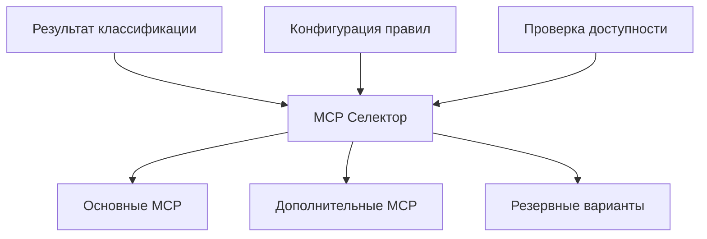

# СЕЛЕКТОР MCP ИНСТРУМЕНТОВ: Автоматический выбор подходящих MCP

## 🎯 НАЗНАЧЕНИЕ

Автоматически выбирает оптимальные MCP инструменты на основе результатов классификации задачи, обеспечивая максимальную эффективность выполнения.

---

## 🔧 АРХИТЕКТУРА СЕЛЕКТОРА

### **Схема работы**



### **Входные данные**

```yaml
Input_Format:
  classification:
    primary_type: "DEVELOPMENT"
    secondary_type: "RESEARCH"  # опционально
    confidence: 0.85
    context: 
      file_types: [".bsl", ".xml"]
      directories: ["CommonModules/"]
      complexity: "medium"
  
  environment:
    available_mcps: ["task-master", "sequential-thinking", "serena"]
    project_context: "1c-enterprise"
    user_preferences: {...}
```

---

## 📋 МАТРИЦА ВЫБОРА MCP

### **Основная таблица соответствий**

| Тип задачи | Основные MCP | Дополнительные MCP | Условия |
|------------|-------------|-------------------|---------|
| **DEVELOPMENT** | Task Master, Git Project | Sequential Thinking | confidence >= 80% |
| **RESEARCH** | Sequential Thinking, Reasoner | Memory, Web Search | требует анализа |
| **PROJECT_MANAGEMENT** | Task Master | Sequential Thinking | управление задачами |
| **AUTOMATION** | Orchestrator | Task Master, Git Project | скрипты/workflows |
| **EDUCATION** | Sequential Thinking | Memory, Web Search | обучение/документация |

### **Специализированные правила для 1С**

```yaml
1C_Enterprise_Rules:
  BSL_Development:
    condition: "file_types contains .bsl"
    primary_mcp: ["Task Master", "Serena"]
    additional: ["Sequential Thinking"]
    reasoning: "BSL разработка требует управления задачами и сохранения контекста"
  
  Configuration_Analysis:
    condition: "mentions configuration OR .xml files"
    primary_mcp: ["Sequential Thinking", "Serena"]
    additional: ["Memory"]
    reasoning: "Анализ конфигурации требует глубокого мышления"
  
  Quality_Control:
    condition: "mentions quality OR testing OR validation"
    primary_mcp: ["Sequential Thinking", "Task Master"]
    additional: ["Git Project"]
    reasoning: "Контроль качества требует систематического подхода"
```

---

## 🎯 АЛГОРИТМЫ ВЫБОРА

### **1. Базовый алгоритм**

```javascript
function selectMCP(classification, context) {
    const selection = {
        primary: [],
        secondary: [],
        fallback: [],
        confidence: classification.confidence
    };
    
    // Выбор основных MCP
    const primaryRule = getPrimaryRule(classification.primary_type);
    selection.primary = primaryRule.mcps;
    
    // Добавление вторичных MCP
    if (classification.secondary_type) {
        const secondaryRule = getSecondaryRule(classification.secondary_type);
        selection.secondary = secondaryRule.mcps;
    }
    
    // Контекстные модификации
    applyContextRules(selection, context);
    
    // Проверка доступности
    filterByAvailability(selection);
    
    return selection;
}
```

### **2. Правила приоритизации**

```yaml
Priority_Rules:
  High_Confidence:
    condition: "confidence >= 85%"
    action: "use_primary_mcps_only"
    
  Medium_Confidence:
    condition: "confidence 70-85%"
    action: "add_supporting_mcps"
    
  Low_Confidence:
    condition: "confidence < 70%"
    action: "request_clarification + fallback_mcps"
    
  Hybrid_Tasks:
    condition: "has_secondary_type"
    action: "combine_mcp_sets + prioritize_by_confidence"
```

### **3. Контекстные модификаторы**

```yaml
Context_Modifiers:
  File_Context:
    ".bsl files": 
      add: ["Serena"]
      reason: "BSL код требует сохранения в памяти"
    
    ".md files":
      add: ["Memory", "Web Search"] 
      reason: "Документация может требовать исследования"
  
  Directory_Context:
    "CommonModules/":
      boost: ["Task Master", "Sequential Thinking"]
      reason: "Общие модули - критически важный код"
    
    "scripts/":
      boost: ["Orchestrator"]
      reason: "Скрипты требуют автоматизации"
  
  Complexity_Context:
    "high":
      add: ["Sequential Thinking"]
      reason: "Сложные задачи требуют глубокого анализа"
    
    "low":
      simplify: true
      reason: "Простые задачи не требуют множества инструментов"
```

---

## 🔄 ТИПЫ ВЫБОРА MCP

### **1. Простой выбор (Single-purpose)**

```yaml
Simple_Selection:
  Development_Task:
    input: "Создать новую функцию экспорта"
    classification: {type: "DEVELOPMENT", confidence: 0.92}
    output:
      primary: ["Task Master"]
      secondary: ["Git Project"]
      reasoning: "Четкая задача разработки с высокой уверенностью"
```

### **2. Комбинированный выбор (Multi-purpose)**

```yaml
Combined_Selection:
  Research_Development:
    input: "Изучить и внедрить новый паттерн"
    classification: 
      primary: "DEVELOPMENT"
      secondary: "RESEARCH"
      confidence: 0.78
    output:
      primary: ["Sequential Thinking", "Task Master"]
      secondary: ["Memory", "Web Search"]
      reasoning: "Гибридная задача требует исследования + разработки"
```

### **3. Адаптивный выбор (Adaptive)**

```yaml
Adaptive_Selection:
  Progressive_Task:
    phase_1: 
      mcps: ["Sequential Thinking", "Web Search"]
      purpose: "Исследование и анализ"
    
    phase_2:
      mcps: ["Task Master", "Git Project"] 
      purpose: "Планирование и разработка"
    
    phase_3:
      mcps: ["Orchestrator"]
      purpose: "Автоматизация и развертывание"
```

---

## 📊 СИСТЕМА СКОРИНГА

### **Алгоритм подсчета релевантности**

```javascript
function calculateMCPScore(mcp, classification, context) {
    let score = 0;
    
    // Базовый скор по типу задачи
    score += getBaseScore(mcp, classification.primary_type);
    
    // Бонус за вторичный тип
    if (classification.secondary_type) {
        score += getSecondaryScore(mcp, classification.secondary_type) * 0.6;
    }
    
    // Контекстные модификаторы
    score += getContextScore(mcp, context);
    
    // Штраф за низкую уверенность
    if (classification.confidence < 0.7) {
        score *= classification.confidence;
    }
    
    return Math.max(0, Math.min(100, score));
}
```

### **Матрица базовых скоров**

```yaml
Base_Scores:
  Task_Master:
    DEVELOPMENT: 90
    PROJECT_MANAGEMENT: 95
    AUTOMATION: 60
    RESEARCH: 40
    EDUCATION: 30
  
  Sequential_Thinking:
    RESEARCH: 95
    EDUCATION: 90
    DEVELOPMENT: 70
    PROJECT_MANAGEMENT: 50
    AUTOMATION: 40
  
  Git_Project:
    DEVELOPMENT: 85
    AUTOMATION: 70
    PROJECT_MANAGEMENT: 60
    RESEARCH: 30
    EDUCATION: 20
  
  Orchestrator:
    AUTOMATION: 95
    DEVELOPMENT: 50
    PROJECT_MANAGEMENT: 40
    RESEARCH: 20
    EDUCATION: 15
```

---

## 🎮 ИНТЕРАКТИВНЫЙ РЕЖИМ

### **Режимы работы селектора**

```yaml
Operating_Modes:
  Automatic:
    description: "Полностью автоматический выбор"
    trigger: "confidence >= 80%"
    behavior: "select_and_execute"
  
  Semi_Automatic:
    description: "Выбор с подтверждением"
    trigger: "confidence 60-80%"
    behavior: "suggest_and_confirm"
  
  Interactive:
    description: "Интерактивный выбор"
    trigger: "confidence < 60% OR user_preference"
    behavior: "show_options_and_ask"
  
  Manual:
    description: "Ручной выбор пользователем"
    trigger: "explicit_user_request"
    behavior: "show_all_options"
```

### **Диалог с пользователем**

```markdown
## Пример интерактивного режима

🤖 **Селектор**: Анализ задачи завершен. Обнаружена гибридная задача:
- Основной тип: DEVELOPMENT (75%)
- Вторичный тип: RESEARCH (65%)

📋 **Рекомендуемые MCP**:
1. ✅ **Task Master** (скор: 85) - управление разработкой
2. ✅ **Sequential Thinking** (скор: 80) - анализ архитектуры  
3. ⚪ **Git Project** (скор: 70) - управление кодом
4. ⚪ **Memory** (скор: 60) - сохранение исследований

❓ **Выберите вариант**:
[A] Использовать рекомендуемые (1-2)
[B] Добавить дополнительные (1-4)  
[C] Настроить вручную
[D] Показать подробности
```

---

## 🔗 ИНТЕГРАЦИЯ С WORKFLOW

### **Точки интеграции**

```yaml
Integration_Points:
  Task_Master_Integration:
    trigger: "new_task_created"
    action: "auto_classify_and_select_mcps"
    output: "task_with_recommended_tools"
  
  Chat_Integration:
    trigger: "user_request_detected"
    action: "analyze_message_and_suggest_mcps"
    output: "mcp_recommendations"
  
  Workflow_Integration:
    trigger: "workflow_step_started"
    action: "select_mcps_for_current_step"
    output: "optimized_tool_chain"
```

### **Обновление существующего workflow**

```yaml
# Обновление cursor-rules/16-workflow-integration.md
Enhanced_Workflow:
  Step_1: "Task Master получает задачу"
  Step_1.5: "🆕 MCP Selector выбирает инструменты"
  Step_2: "Sequential Thinking с выбранными MCP"
  Step_3: "Serena сохраняет результаты"
```

---

## 📋 ПРАКТИЧЕСКИЕ ПРИМЕРЫ

### **Пример 1: Простая задача разработки**

```yaml
Input:
  task: "Добавить валидацию в функцию ПроверитьДанные()"
  classification: {type: "DEVELOPMENT", confidence: 0.95}

Selection_Process:
  step_1: "Высокая уверенность → автоматический режим"
  step_2: "DEVELOPMENT → Task Master (95 баллов)"
  step_3: "Контекст .bsl → добавить Serena (80 баллов)"

Output:
  primary_mcps: ["Task Master"]
  secondary_mcps: ["Serena"]
  mode: "automatic"
  reasoning: "Четкая задача разработки BSL кода"
```

### **Пример 2: Исследовательская задача**

```yaml
Input:
  task: "Проанализировать производительность запросов в конфигурации"
  classification: {type: "RESEARCH", confidence: 0.88}

Selection_Process:
  step_1: "Высокая уверенность → автоматический режим"
  step_2: "RESEARCH → Sequential Thinking (95 баллов)"
  step_3: "Анализ производительности → добавить Memory (70 баллов)"

Output:
  primary_mcps: ["Sequential Thinking"]
  secondary_mcps: ["Memory", "Serena"]
  mode: "automatic"
  reasoning: "Исследование требует глубокого анализа и сохранения результатов"
```

### **Пример 3: Сложная гибридная задача**

```yaml
Input:
  task: "Исследовать и внедрить новую архитектуру интеграций с внешними системами"
  classification: 
    primary: "DEVELOPMENT"
    secondary: "RESEARCH" 
    confidence: 0.72

Selection_Process:
  step_1: "Средняя уверенность → полуавтоматический режим"
  step_2: "Комбинация DEVELOPMENT + RESEARCH"
  step_3: "Высокая сложность → добавить Sequential Thinking"

Output:
  primary_mcps: ["Sequential Thinking", "Task Master"]
  secondary_mcps: ["Memory", "Git Project"]
  mode: "semi_automatic"
  user_confirmation: "Рекомендуется подтвердить выбор"
  reasoning: "Сложная архитектурная задача требует исследования + разработки"
```

---

## ⚙️ КОНФИГУРАЦИЯ И НАСТРОЙКА

### **Файл настроек селектора**

```json
{
  "selector_config": {
    "default_mode": "semi_automatic",
    "confidence_thresholds": {
      "automatic": 0.85,
      "semi_automatic": 0.65,
      "interactive": 0.45
    },
    "scoring_weights": {
      "base_score": 1.0,
      "context_bonus": 0.3,
      "confidence_penalty": 0.4
    },
    "mcp_availability": {
      "task-master": true,
      "sequential-thinking": true,
      "serena": true,
      "git-project": false,
      "orchestrator": false
    },
    "user_preferences": {
      "prefer_minimal_tools": false,
      "always_include_serena": true,
      "max_concurrent_mcps": 3
    }
  }
}
```

### **Правила переопределения**

```yaml
Override_Rules:
  User_Preferences:
    "always_use_sequential_thinking": 
      condition: "user_setting"
      action: "force_add Sequential Thinking to all selections"
    
    "minimal_toolset":
      condition: "user_preference"
      action: "use only primary MCP, skip secondary"
  
  Project_Specific:
    "1c_enterprise_project":
      condition: "project_type = 1c"
      action: "boost Serena and Task Master scores"
    
    "research_project": 
      condition: "project_type = research"
      action: "boost Sequential Thinking and Memory scores"
```

---

## 🔧 API И ИНТЕРФЕЙСЫ

### **Основной API**

```javascript
// Основная функция селектора
async function selectMCPTools(classification, context, options = {}) {
    const selection = await mcpSelector.select({
        classification,
        context,
        mode: options.mode || 'auto',
        userPreferences: options.preferences
    });
    
    return {
        primary: selection.primary,
        secondary: selection.secondary,
        confidence: selection.confidence,
        reasoning: selection.reasoning,
        mode: selection.mode
    };
}

// Интерактивный режим
async function interactiveSelection(classification, context) {
    const options = await mcpSelector.getOptions(classification, context);
    const userChoice = await promptUser(options);
    return mcpSelector.applyChoice(userChoice);
}
```

### **Интеграция с существующими системами**

```javascript
// Интеграция с Task Master
TaskMaster.on('task_created', async (task) => {
    const classification = await taskClassifier.classify(task.description);
    const mcpSelection = await mcpSelector.select(classification, task.context);
    task.recommendedMCPs = mcpSelection;
    task.save();
});

// Интеграция с workflow
WorkflowEngine.addStep('mcp_selection', async (context) => {
    const selection = await mcpSelector.select(
        context.classification, 
        context.environment
    );
    context.mcpTools = selection.primary.concat(selection.secondary);
    return context;
});
```

---

## ✅ ТЕСТИРОВАНИЕ И ВАЛИДАЦИЯ

### **Тестовые случаи**

```yaml
Test_Cases:
  basic_development:
    input: {type: "DEVELOPMENT", confidence: 0.9}
    expected_primary: ["Task Master"]
    expected_secondary: ["Git Project"]
  
  research_task:
    input: {type: "RESEARCH", confidence: 0.85}
    expected_primary: ["Sequential Thinking"]
    expected_secondary: ["Memory"]
  
  hybrid_task:
    input: 
      primary: "DEVELOPMENT"
      secondary: "RESEARCH"
      confidence: 0.75
    expected_primary: ["Sequential Thinking", "Task Master"]
    expected_mode: "semi_automatic"
  
  low_confidence:
    input: {type: "UNKNOWN", confidence: 0.45}
    expected_mode: "interactive"
    expected_action: "request_clarification"
```

### **Метрики качества**

```yaml
Quality_Metrics:
  selection_accuracy:
    description: "Процент правильных выборов MCP"
    target: "> 85%"
  
  user_satisfaction:
    description: "Удовлетворенность пользователей выбором"
    target: "> 80%"
  
  execution_efficiency:
    description: "Эффективность выполнения с выбранными MCP"
    target: "> 90%"
  
  response_time:
    description: "Время выбора MCP"
    target: "< 2 секунд"
```

---

**📅 Создано**: 2025-09-22  
**🎯 Статус**: Готов к интеграции  
**🔗 Связанные модули**: 17-mcp-task-classifier.md, 19-mcp-selection-config.md  
**📋 Зависимости**: Task Master, Sequential Thinking, Serena