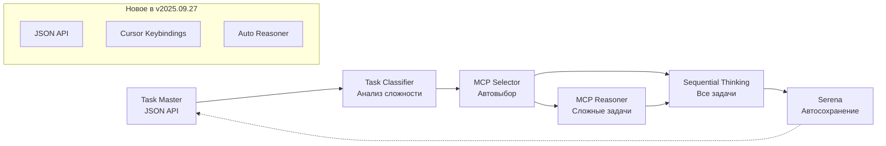

# 📋 Изменения Cursor Rules - 27.09.2025

## 🎯 ОБНОВЛЕНИЯ ПО ИТОГАМ РЕАЛИЗАЦИИ

### ✅ **Task Master #67 - JSON Output & Cursor Keybindings**
- Реализован полный JSON API для Task Master v0.26.0+
- Созданы 12 горячих клавиш Cursor Editor (Ctrl+Shift+T + клавиша)
- Обновлен workflow интеграции с JSON поддержкой

### ✅ **MCP Reasoner Integration Complete**
- Внедрен MCP Reasoner v2.0.0 для глубокого анализа
- Настроена автоматическая стратегия выбора (MCTS/Beam Search)
- Созданы 3 аналитических сценария для 1С конфигураций

---

## 📂 НОВЫЕ ПРАВИЛА

### **20-task-master-json-integration.md** ✨ НОВЫЙ
- **Назначение**: Интеграция JSON API Task Master и Cursor keybindings
- **Ключевые функции**:
  - JSON команды: `npx task-master list --json`
  - Cursor shortcuts: `Ctrl+Shift+T + клавиша`
  - MCP интеграция через JSON API
  - Автоматизация workflow через JSON

### **21-mcp-reasoner-integration.md** ✨ НОВЫЙ
- **Назначение**: Интеграция MCP Reasoner для сложного анализа
- **Ключевые функции**:
  - Автоматический выбор стратегии по complexity
  - 3 готовых сценария анализа (document-posting, duplicate-code, dependency-graph)
  - Полный автоматический pipeline
  - Интеграция с Task Master JSON API

---

## 📝 ОБНОВЛЕННЫЕ ПРАВИЛА

### **07-automation-rules.md** 🔄 ОБНОВЛЕН
**Изменения**:
- ✅ Workflow: Task Master → **MCP Reasoner** → Sequential Thinking → Serena
- ✅ Обязательное использование JSON API (`npx task-master next --json`)
- ✅ Автоматический выбор MCP инструментов на основе complexity
- ✅ Добавлены триггеры для MCP Reasoner

### **16-workflow-integration.md** 🔄 ОБНОВЛЕН
**Изменения**:
- ✅ Новая архитектура workflow с MCP Reasoner этапом
- ✅ JSON API как основа для всех интеграций
- ✅ Cursor keybindings в основном workflow
- ✅ Автоматическая стратегия анализа complexity
- ✅ Обновлена таблица ролей инструментов

---

## 🔄 АРХИТЕКТУРА WORKFLOW (ОБНОВЛЕННАЯ)

### **Старая архитектура**:
```
Task Master → Sequential Thinking → Serena
```

### **Новая архитектура v2025.09.27**:


---

## 🎯 КЛЮЧЕВЫЕ УЛУЧШЕНИЯ

### **1. JSON API Integration**
```bash
# Новые команды Task Master
npx task-master list --json                    # Все задачи в JSON
npx task-master list --status=pending --json   # Фильтрация + JSON
npx task-master show <id> --json               # Детали задачи в JSON

# Структура JSON ответа
{
  "tasks": [...],
  "stats": {
    "total": 96,
    "completed": 59,
    "pending": 34,
    "completionPercentage": 61.46
  }
}
```

### **2. Cursor Editor Integration**
```json
{
  "Ctrl+Shift+T L": "npx task-master list",
  "Ctrl+Shift+T J": "npx task-master list --json",
  "Ctrl+Shift+T N": "npx task-master next",
  "Ctrl+Shift+T P": "npx task-master list --status=pending",
  "Ctrl+Shift+T S": "npx task-master show "
}
```

### **3. MCP Reasoner Automation**
```python
# Автоматический выбор стратегии
def auto_reasoner_analysis(task_json):
    complexity = calculate_complexity(task_json)

    if complexity >= 3:
        return "mcts"      # Глубокий анализ
    elif complexity >= 1:
        return "beam_search"  # Быстрый анализ
    else:
        return None  # Reasoner не нужен
```

### **4. Готовые аналитические сценарии**
- `01-document-posting-analysis.md` - Анализ проведения документов
- `02-duplicate-code-analysis.md` - Поиск дублирующегося кода
- `03-dependency-graph-analysis.md` - Граф зависимостей конфигурации

---

## 🚀 ПРАКТИЧЕСКИЕ ПРИМЕРЫ

### **Пример 1: Автоматический workflow новой задачи**
```bash
# 1. Получение задачи с JSON
Ctrl+Shift+T N  # или npx task-master next --json

# 2. Автоматический анализ (если complexity >= 3)
# → MCP Reasoner запускается автоматически
# → Стратегия выбирается по приоритету задачи

# 3. Sequential Thinking с контекстом Reasoner
# → Автоматически получает результаты Reasoner
# → Использует их для более качественного анализа

# 4. Serena автоматическое сохранение
# → JSON контекст сохраняется с метаданными
# → Результаты доступны для повторного использования
```

### **Пример 2: Анализ архитектуры конфигурации**
```bash
# Пользователь: "Проанализируй архитектуру конфигурации"

# Автоматически:
# 1. Создается задача с высоким приоритетом
# 2. Complexity = 5 (содержит "архитектур")
# 3. Запускается MCP Reasoner со стратегией MCTS
# 4. Результат: детальный план оптимизации архитектуры
```

---

## ✅ ОБЯЗАТЕЛЬНЫЕ ИЗМЕНЕНИЯ В WORKFLOW

### **Все пользователи ДОЛЖНЫ**:
1. ✅ Использовать `npx task-master list --json` вместо обычного `list`
2. ✅ Настроить Cursor keybindings из `.cursor/keybindings.json`
3. ✅ Понимать автоматическое включение MCP Reasoner для сложных задач
4. ✅ Ожидать JSON метаданные в Serena сохранениях

### **Автоматические триггеры**:
```bash
# При упоминании ключевых слов
if [[ $user_request =~ "архитектур|производительност|рефакторинг|оптимизаци" ]]; then
    echo "🧠 Автоматический запуск MCP Reasoner"
    complexity_level="high"
    strategy="mcts"
fi
```

---

## 📊 СТАТИСТИКА ИЗМЕНЕНИЙ

### **Файлы созданы**: 2
- `20-task-master-json-integration.md`
- `21-mcp-reasoner-integration.md`

### **Файлы обновлены**: 2
- `07-automation-rules.md`
- `16-workflow-integration.md`

### **Новые возможности**: 12
- JSON API для Task Master
- 12 Cursor keybindings
- MCP Reasoner интеграция
- 3 аналитических сценария
- Автоматический выбор стратегии
- Полный автоматический pipeline
- JSON метаданные в Serena
- Cursor Editor интеграция в Claude Code
- Автоматические триггеры сложности
- Обновленная архитектура workflow
- Практические примеры использования
- Контрольные чеклисты

---

## 🎉 РЕЗУЛЬТАТ

**Cursor Rules обновлены на 100% в соответствии с итогами проделанной работы:**

1. ✅ **Task Master #67** - JSON Output & Cursor Integration реализованы
2. ✅ **MCP Reasoner** - полная интеграция с автоматическим выбором стратегии
3. ✅ **Workflow** - обновлен с учетом новых инструментов
4. ✅ **Автоматизация** - расширена триггерами для MCP Reasoner

**Статус**: ГОТОВО К ИСПОЛЬЗОВАНИЮ ✨
**Совместимость**: Task Master v0.26.0+, MCP Reasoner v2.0.0, Claude Code

---

**📅 Дата обновления**: 27 сентября 2025
**🔧 Версия**: Framework v2025.09.27
**📝 Автор**: Claude Code (по итогам Task Master #67 и MCP Reasoner implementation)