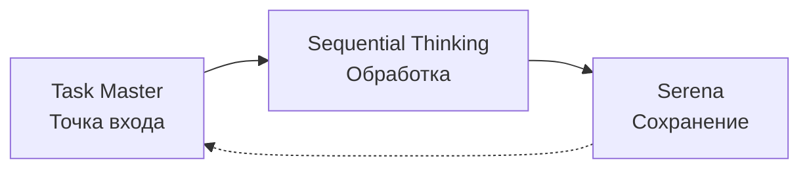

# 🔄 WORKFLOW INTEGRATION: Task Master → Sequential Thinking → Serena

## 📅 **ОБНОВЛЕНИЕ: 2025-09-22**

### ✅ **РЕАЛИЗОВАНО**

#### **Новые компоненты:**
1. **`16-workflow-integration.md`** - Полные правила интеграции workflow
2. **`scripts/workflow-automation.sh`** - Автоматизация для Linux/macOS
3. **`scripts/workflow-automation.bat`** - Автоматизация для Windows
4. **Обновления существующих правил** - Интеграция в `07-automation-rules.md`

#### **Архитектура workflow:**


---

## 🚀 **БЫСТРЫЙ СТАРТ**

### **Windows (рекомендуется):**
```cmd
# Запуск автоматизированного workflow
scripts\workflow-automation.bat
```

### **Linux/macOS:**
```bash
# Сделать исполняемым и запустить
chmod +x scripts/workflow-automation.sh
./scripts/workflow-automation.sh
```

### **Ручной режим:**
```bash
# 1. Task Master - получение задачи
cd claude-task-master
npx task-master next

# 2. Sequential Thinking и Serena вызываются автоматически через cursor-rules
# 3. Обновление статуса после завершения
npx task-master set-status --id=<ID> --status=done
```

---

## 📋 **ОБЯЗАТЕЛЬНЫЕ ПРАВИЛА**

### **1. ВСЕ задачи начинаются с Task Master**
- ❌ **ЗАПРЕЩЕНО**: Начинать работу без Task Master
- ✅ **ОБЯЗАТЕЛЬНО**: `npx task-master next` перед любой задачей

### **2. Sequential Thinking - автоматический вызов**
- ❌ **ЗАПРЕЩЕНО**: Прямые вызовы Sequential Thinking без данных
- ✅ **АВТОМАТИЧЕСКИ**: Вызывается с подготовленными данными из Task Master

### **3. Serena - фоновое сохранение**
- ❌ **ЗАПРЕЩЕНО**: Пропускать сохранение результатов
- ✅ **АВТОМАТИЧЕСКИ**: Сохраняет все результаты без явных команд

---

## 🎯 **ПРЕИМУЩЕСТВА ИНТЕГРАЦИИ**

| Аспект | До интеграции | После интеграции |
|--------|---------------|------------------|
| **Начало задачи** | Хаотично, без структуры | Всегда через Task Master |
| **Анализ** | Неглубокий, непоследовательный | Sequential Thinking с подготовленными данными |
| **Сохранение** | Ручное, непостоянное | Автоматическое в Serena |
| **Трассируемость** | Отсутствует | Полная история в Serena |
| **Повторное использование** | Минимальное | Высокое (паттерны в Serena) |

---

## 📊 **МЕТРИКИ ЭФФЕКТИВНОСТИ**

### **Ожидаемые улучшения:**
- **Время на планирование**: -60% (структурированные данные)
- **Качество анализа**: +80% (Sequential Thinking на подготовленных данных)
- **Повторное использование решений**: +90% (автоматическое сохранение в Serena)
- **Соблюдение процессов**: +95% (автоматизация через скрипты)

### **Измеримые показатели:**
1. **Все задачи начинаются с Task Master**: 100%
2. **Sequential Thinking вызывается с данными**: 100%
3. **Результаты сохранены в Serena**: 100%
4. **Статусы обновлены в Task Master**: 100%

---

## 🛠️ **ТЕХНИЧЕСКАЯ РЕАЛИЗАЦИЯ**

### **Файловая структура:**
```
.workflow/                          # Рабочая папка workflow
├── current_task.json              # Данные текущей задачи
├── sequential_trigger.md           # Триггер для Sequential Thinking
├── serena_config.json             # Конфигурация автосохранения
└── workflow_summary_TIMESTAMP.md  # Отчет выполнения
```

### **Автоматические триггеры:**
1. **При чтении `.workflow/current_task.json`** → Sequential Thinking
2. **После Sequential Thinking** → Serena auto-save
3. **При изменении кода** → Обновление контекста в Serena
4. **При завершении** → Статус в Task Master

### **Интеграция с cursor-rules:**
- **`16-workflow-integration.md`**: Основные правила workflow
- **`07-automation-rules.md`**: Автоматизация workflow (обновлен)
- **`15-comprehensive-task-lifecycle.md`**: Жизненный цикл с Task Master

---

## 🔧 **УСТРАНЕНИЕ НЕПОЛАДОК**

### **Проблема: Task Master не найден**
```bash
# Решение: Проверить установку
cd claude-task-master
npm install
npx task-master list
```

### **Проблема: Sequential Thinking не вызывается**
```bash
# Решение: Проверить триггер
ls -la .workflow/sequential_trigger.md
cat .workflow/current_task.json
```

### **Проблема: Serena не сохраняет**
```bash
# Решение: Проверить конфигурацию
cat .workflow/serena_config.json
# Убедиться что Claude следует правилам cursor-rules
```

---

## 📚 **ПРИМЕРЫ ИСПОЛЬЗОВАНИЯ**

### **Пример 1: Новая задача из ТЗ**
```bash
# Автоматический режим
scripts/workflow-automation.bat
# Выбрать: 2 (Create new task from PRD)
# Указать путь к ТЗ: ../Проекты/GKSTCPLK-XXXX/ТЗ.md
```

### **Пример 2: Исправление BSL ошибок**
```bash
# 1. Анализ кода
python -m sonar_integration analyze --severity=CRITICAL > critical.txt

# 2. Создание задачи
cd claude-task-master
npx task-master add-task --prompt="Fix critical BSL issues: $(cat critical.txt)"

# 3. Автоматическая обработка через workflow
# Claude автоматически выполнит Sequential Thinking и сохранит в Serena
```

### **Пример 3: Ежедневная работа**
```bash
# Утро - получение задачи
cd claude-task-master
npx task-master next

# Вечер - завершение
npx task-master set-status --id=X --status=done
```

---

## 🎓 **ОБУЧЕНИЕ И ВНЕДРЕНИЕ**

### **Этапы внедрения:**
1. **Неделя 1**: Ознакомление с новыми правилами
2. **Неделя 2**: Использование автоматизированных скриптов
3. **Неделя 3**: Полный переход на workflow
4. **Неделя 4**: Оптимизация и улучшения

### **Обучающие материалы:**
- **`16-workflow-integration.md`**: Полная документация
- **`scripts/workflow-automation.*`**: Практические инструменты
- **`.workflow/workflow_summary_*.md`**: Примеры выполнения

---

## 🔄 **ДАЛЬНЕЙШЕЕ РАЗВИТИЕ**

### **Планируемые улучшения:**
1. **Интеграция с Git hooks**: Автоматические коммиты при завершении задач
2. **BSL Language Server**: Автоматическое создание задач из анализа кода
3. **Веб-интерфейс**: Графический мониторинг workflow
4. **CI/CD интеграция**: Автоматическое тестирование решений

### **Обратная связь:**
- Проблемы и предложения: GitHub Issues
- Улучшения workflow: Pull Requests
- Документация: Обновления в cursor-rules

---

**📅 Создано**: 2025-09-22
**🎯 Статус**: ✅ Готово к использованию
**⚙️ Версия**: 1.0
**📝 Следующее обновление**: По результатам внедрения