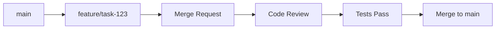

# ⚙️ Git Automation Tools - API Documentation

## 📖 Обзор системы автоматизации

Git Automation Tools в 1C-Enterprise_Cursor_Framework обеспечивают полную автоматизацию процессов версионного контроля с интеграцией в экосистему разработки 1С.

## 🎯 Основные компоненты

### **1️⃣ cursor-rules/05-git-workflow.md**
Центральный модуль автоматизации Git процессов

### **2️⃣ Автоматические Git хуки**  
Система валидации и контроля качества

### **3️⃣ Интеграция с Claude Code**
AI-ассистированное управление версиями

---

## 🔧 Автоматизированные процессы

### **Создание веток**
```bash
# Автоматическое именование веток по задачам
git checkout -b feature/GKSTCPLK-1234-description
git checkout -b fix/bug-name
git checkout -b docs/update-architecture
```

**Шаблоны именования:**
- `feature/` - новый функционал
- `fix/` - исправления ошибок  
- `docs/` - обновление документации
- `refactor/` - рефакторинг кода
- `test/` - добавление тестов

### **Автоматические коммиты**
```bash
# Структурированные сообщения коммитов
git commit -m "$(cat <<'EOF'
feat: добавлена функция обработки данных

- Реализован алгоритм валидации входных параметров
- Добавлена обработка ошибок и логирование
- Создана документация API методов

Closes: GKSTCPLK-1234

🤖 Generated with [Claude Code](https://claude.ai/code)

Co-Authored-By: Claude <noreply@anthropic.com>
EOF
)"
```

**Типы коммитов:**
- `feat:` - новая функциональность
- `fix:` - исправление ошибки
- `docs:` - изменения в документации
- `style:` - форматирование, исправления стиля
- `refactor:` - рефакторинг кода
- `test:` - добавление тестов
- `chore:` - обслуживание, конфигурация

---

## 🔄 Git Workflow процессы

### **GitLab Flow интеграция**


### **Автоматическое управление ветками**
```bash
# Создание feature ветки
create_feature_branch() {
    local task_id=$1
    local description=$2
    git checkout main
    git pull origin main
    git checkout -b "feature/${task_id}-${description}"
}

# Завершение feature
finish_feature() {
    git checkout main
    git merge --no-ff feature/$1
    git branch -d feature/$1
    git push origin main
}
```

---

## 🛡️ Система валидации (Git Hooks)

### **Pre-commit Hook**
```bash
#!/bin/bash
# .git/hooks/pre-commit

# 1. Проверка BSL Language Server
echo "🔍 Запуск BSL анализа..."
bsl-language-server --analyze . --reporter console --config .bsl-language-server.json

if [ $? -ne 0 ]; then
    echo "❌ Найдены критические ошибки BSL. Коммит отклонен."
    exit 1
fi

# 2. Проверка форматирования
echo "📝 Проверка форматирования..."
for file in $(git diff --cached --name-only --diff-filter=ACM | grep -E '\.(bsl|os)$'); do
    # Проверка кодировки UTF-8 BOM
    if ! file "$file" | grep -q "UTF-8"; then
        echo "❌ Файл $file не в кодировке UTF-8 BOM"
        exit 1
    fi
done

# 3. Проверка структуры коммита
commit_msg_file=".git/COMMIT_EDITMSG"
if [ -f "$commit_msg_file" ]; then
    first_line=$(head -n 1 "$commit_msg_file")
    if ! echo "$first_line" | grep -qE '^(feat|fix|docs|style|refactor|test|chore):.+'; then
        echo "❌ Некорректный формат сообщения коммита"
        echo "Используйте: type: описание"
        exit 1
    fi
fi

echo "✅ Все проверки пройдены"
```

### **Commit-msg Hook**
```bash
#!/bin/bash
# .git/hooks/commit-msg

commit_regex='^(feat|fix|docs|style|refactor|test|chore)(\(.+\))?: .{1,50}'

if ! grep -qE "$commit_regex" "$1"; then
    echo "❌ Неправильный формат сообщения коммита!" >&2
    echo "Формат: type(scope): subject" >&2
    echo "Пример: feat(auth): добавлена авторизация пользователя" >&2
    exit 1
fi
```

### **Pre-push Hook**
```bash
#!/bin/bash
# .git/hooks/pre-push

echo "🧪 Запуск тестов перед push..."

# Запуск unit тестов (если есть)
if [ -f "run-tests.sh" ]; then
    ./run-tests.sh
    if [ $? -ne 0 ]; then
        echo "❌ Тесты не прошли. Push отклонен."
        exit 1
    fi
fi

# Проверка что коммиты подписаны
for commit in $(git rev-list @{u}..HEAD); do
    if ! git show --format="%B" $commit | grep -q "Co-Authored-By:"; then
        echo "❌ Коммит $commit не содержит подписи Co-Authored-By"
        exit 1
    fi
done

echo "✅ Все проверки перед push пройдены"
```

---

## 🤖 Claude Code интеграция

### **Автоматические Git команды через Claude**
```python
# Создание коммита с Claude Code
def create_automated_commit(changes_description, task_id=None):
    # 1. Анализ изменений
    git_status = run_command("git status --porcelain")
    
    # 2. Генерация сообщения коммита
    commit_type = determine_commit_type(changes_description)
    commit_message = generate_commit_message(
        commit_type, 
        changes_description, 
        task_id
    )
    
    # 3. Валидация через BSL
    bsl_result = run_bsl_analysis()
    if bsl_result.has_errors():
        raise ValidationError("BSL анализ выявил ошибки")
    
    # 4. Создание коммита
    run_command(f"git add .")
    run_command(f"git commit -m '{commit_message}'")
    
    return commit_message
```

### **Интеграция с системой задач**
```python
# Автоматическое связывание с Jira/GitLab Issues
def create_task_branch(task_id, description):
    branch_name = f"feature/{task_id}-{slugify(description)}"
    
    # Создание ветки
    run_command(f"git checkout -b {branch_name}")
    
    # Сохранение метаданных задачи
    task_metadata = {
        "task_id": task_id,
        "description": description,
        "created_at": datetime.now().isoformat(),
        "branch": branch_name
    }
    
    # Запись в систему памяти MCP
    serena__write_memory(f"task_{task_id}", task_metadata)
```

---

## 📊 Мониторинг и аналитика

### **Git метрики**
```bash
# Статистика коммитов
git log --oneline --since="1 month ago" | wc -l

# Анализ активности по авторам
git shortlog -sn --since="1 month ago"

# Частота изменений файлов
git log --format=format: --name-only --since="1 month ago" | \
    grep -v '^$' | sort | uniq -c | sort -rn
```

### **Автоматические отчеты**
```python
def generate_git_report(period="1 month"):
    report = {
        "period": period,
        "total_commits": get_commit_count(period),
        "active_branches": get_active_branches(),
        "merge_requests": get_merge_requests(period),
        "code_quality_trends": get_bsl_trends(period)
    }
    
    # Сохранение отчета
    serena__write_memory(f"git_report_{date.today()}", report)
    
    return report
```

---

## 🔄 Интеграция с cursor-rules

### **Связь с модулями фреймворка:**

#### **cursor-rules/05-git-workflow.md**
- Основные правила Git процессов
- Шаблоны коммитов и веток
- Интеграция с системой качества

#### **cursor-rules/03-quality-control.md**  
- Git hooks для контроля качества
- Интеграция с BSL Language Server
- Автоматическая валидация

#### **cursor-rules/04-file-management.md**
- Логирование Git операций
- Синхронизация с файловой системой
- Автоматическое резервное копирование

---

## 🚀 Расширенные возможности

### **Автоматическая синхронизация**
```bash
# Синхронизация с upstream
sync_with_upstream() {
    git fetch upstream
    git checkout main
    git merge upstream/main
    git push origin main
}
```

### **Интеллектуальные merge**
```bash
# Умное слияние с разрешением конфликтов
intelligent_merge() {
    local source_branch=$1
    local target_branch=$2
    
    # Предварительный анализ конфликтов
    git merge-base $source_branch $target_branch
    
    # Автоматическое разрешение простых конфликтов
    git merge $source_branch --strategy-option=ours
}
```

### **CI/CD интеграция**
```yaml
# .gitlab-ci.yml
stages:
  - validate
  - test
  - deploy

validate_bsl:
  stage: validate
  script:
    - bsl-language-server --analyze . --reporter junit
  artifacts:
    reports:
      junit: bsl-report.xml

auto_deploy:
  stage: deploy
  script:
    - ./deploy.sh
  only:
    - main
```

---

## 📋 Команды управления

### **Быстрые команды фреймворка:**
```bash
# Создание feature ветки с задачей
fw-feature create GKSTCPLK-1234 "Добавить новый модуль"

# Завершение feature с автоматическим merge
fw-feature finish GKSTCPLK-1234

# Создание hotfix
fw-hotfix create "Исправление критической ошибки"

# Синхронизация с главной веткой
fw-sync main

# Создание release ветки
fw-release create v1.2.3
```

### **Интеграция с Claude Code:**
```bash
# Анализ изменений через Claude
claude-git analyze-changes

# Генерация коммита через Claude  
claude-git auto-commit "Описание изменений"

# Создание merge request через Claude
claude-git create-mr "Заголовок MR"
```

---

## ⚠️ Рекомендации и ограничения

### **Безопасность:**
- ✅ Все операции логируются
- ✅ Обязательная подпись коммитов
- ✅ Валидация перед push
- ❌ Прямой push в main запрещен

### **Производительность:**
- ✅ Кэширование результатов анализа
- ✅ Инкрементальная проверка изменений
- ✅ Параллельная обработка hooks

### **Совместимость:**
- ✅ GitLab / GitHub / Bitbucket
- ✅ Windows / Linux / macOS
- ✅ Различные СУБД для 1С

---

**📅 Версия документа:** 1.0  
**🗓️ Последнее обновление:** 03.09.2025  
**👤 Ответственный:** Команда 1C-Enterprise Cursor Framework  
**🔗 Связанные документы:** `cursor-rules/05-git-workflow.md`, `ultimate-hooks-system.md`

*Подробная настройка и конфигурация доступны в cursor-rules/05-git-workflow.md*