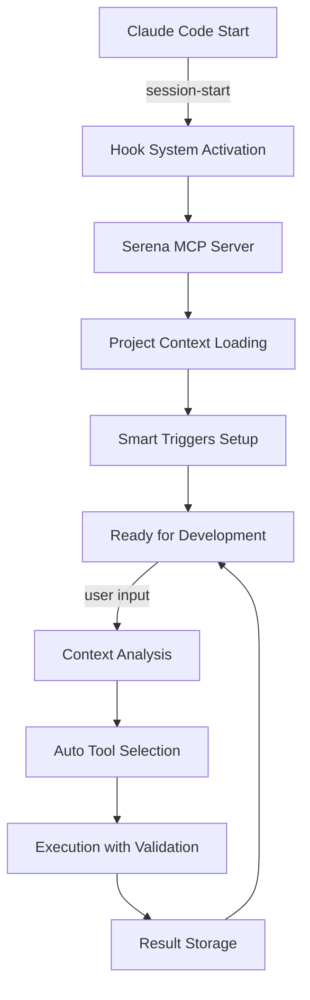

# 🔧 ULTIMATE Hooks Technical Reference - Техническая документация

## 📖 Обзор технической реализации

Техническая документация системы 22 автоматических хуков с интеграцией 35 MCP команд Serena Framework для разработки 1С:Enterprise проектов.

### 🏗️ Структура компонентов
```
.claude-code-hooks-ultimate.json       # Главная конфигурация (22 хука)
├── hooks/
│   ├── session-start                  # Инициализация (4 хука)
│   ├── user-interaction               # Обработка запросов (2 хука)
│   ├── code-editing                   # Редактирование (3 хука)
│   ├── tool-management               # Управление инструментами (4 хука)
│   ├── mode-switching                # Переключение режимов (3 хука)
│   ├── quality-control               # Контроль качества (1 хук)
│   └── project-lifecycle             # Жизненный цикл (5 хуков)
├── scripts/
│   ├── hooks-manager.sh              # Менеджер хуков (17.1 KB)
│   ├── jetbrains-integration.sh      # JetBrains интеграция (12.1 KB)
│   ├── line-editor.sh               # Построчное редактирование (17.0 KB)
│   ├── mode-switcher.sh             # Переключение режимов (17.0 KB)
│   └── lsp-manager.sh               # Управление LSP (18.6 KB)
└── .serena/
    ├── memories/                     # База знаний проекта
    ├── hooks-backups/               # Резервные копии
    ├── jetbrains-cache/             # Кэш JetBrains
    ├── mode-contexts/               # Контексты режимов
    └── logs/                        # Логи системы
```

### Диаграмма потока данных


## Спецификация хуков

### Группа инициализации (4 хука)

#### session-start
```json
{
  "command": "serena-mcp-server",
  "args": ["serena__activate_project", "/mnt/d/1C-Enterprise_Cursor_Framework"],
  "description": "🚨 Критическая активация Serena Framework",
  "timeout": 10000,
  "enabled": true,
  "priority": 1
}
```

**Алгоритм выполнения:**
1. Запуск MCP сервера Serena
2. Активация проекта по указанному пути
3. Инициализация базовых настроек
4. Проверка доступности всех компонентов

**Критерии успеха:**
- MCP сервер отвечает в течение 10 секунд
- Проект успешно загружен
- Все зависимости доступны

#### session-start-load-rules
```json
{
  "command": "serena-mcp-server", 
  "args": ["serena__list_memories"],
  "description": "Загрузка всех правил фреймворка из базы знаний",
  "timeout": 8000,
  "enabled": true,
  "priority": 2
}
```

**Алгоритм выполнения:**
1. Получение списка всех сохраненных знаний
2. Приоритизация по важности и свежести
3. Загрузка критически важных правил
4. Создание индекса для быстрого доступа

#### session-start-config
```json
{
  "command": "serena-mcp-server",
  "args": ["serena__get_current_config"],  
  "description": "Диагностика текущей конфигурации",
  "timeout": 5000,
  "enabled": true,
  "priority": 3
}
```

**Алгоритм выполнения:**
1. Проверка всех активных компонентов
2. Валидация конфигурации проекта
3. Выявление потенциальных проблем
4. Подготовка отчета о готовности

#### session-start-jetbrains-detect
```json
{
  "command": "/scripts/jetbrains-integration.sh",
  "args": ["detect"],
  "description": "Обнаружение JetBrains проектов",
  "timeout": 3000,
  "enabled": true,
  "priority": 4
}
```

**Алгоритм выполнения:**
1. Сканирование на наличие `.idea/`, `*.iml` файлов
2. Определение типа JetBrains IDE (IntelliJ, 1C:EDT, DataGrip)
3. Настройка интеграционных параметров
4. Активация JetBrains-специфичных хуков

### Группа обработки запросов (2 хука)

#### user-prompt-submit
```json
{
  "command": "serena-mcp-server",
  "args": ["serena__think_about_collected_information", "--prompt", "{{prompt}}"],
  "description": "Анализ полноты информации для ответа",
  "timeout": 5000,
  "enabled": true
}
```

**Алгоритм анализа:**
1. **Анализ запроса** - извлечение ключевых сущностей
2. **Оценка контекста** - достаточно ли данных для ответа
3. **Автоматическая загрузка** недостающей информации
4. **Подготовка контекста** для качественного ответа

#### user-prompt-mode-check
```json
{
  "command": "/scripts/mode-switcher.sh",
  "args": ["analyze", "{{prompt}}"],
  "description": "Автоматическое определение режима работы",
  "timeout": 3000,
  "enabled": true
}
```

**Триггерные слова:**
- **"отладка", "ошибка", "не работает"** → `Debugging Mode`
- **"архитектура", "структура", "анализ"** → `Analysis Mode`
- **"создать", "написать", "реализовать"** → `Development Mode`
- **"как", "почему", "объясни"** → `Consulting Mode`

### Группа редактирования кода (3 хука)

#### pre-edit
```json
{
  "trigger_on": ["edit_tool", "multiedit_tool"],
  "command": "serena-mcp-server",
  "args": ["serena__get_symbols_overview", "--file", "{{file_path}}"],
  "description": "Анализ структуры перед редактированием",
  "timeout": 3000,
  "enabled": true
}
```

**Технические возможности:**
- **Предотвращение ошибок** - понимание структуры до изменений
- **Контекстные подсказки** - знание о существующих методах
- **Валидация архитектуры** - соответствие паттернам проекта

#### post-edit
```json
{
  "trigger_on": ["edit_complete", "write_complete"],
  "command": "/scripts/validate-bsl-code.sh",
  "args": ["{{file_path}}"],
  "description": "Валидация BSL кода после изменений",
  "timeout": 5000,
  "enabled": true
}
```

**Многоступенчатая проверка:**
1. **BSL Language Server** - 793 правила качества
2. **Синтаксическая проверка** - корректность кода
3. **Стилистическая валидация** - соответствие стандартам
4. **Автоисправление** простых проблем

#### post-large-changes
```json
{
  "condition": "files_changed > 3 OR lines_changed > 50",
  "command": "serena-mcp-server",
  "args": ["serena__summarize_changes"],
  "description": "Автосуммаризация больших изменений",
  "timeout": 8000,
  "enabled": true
}
```

**Критерии активации:**
- Изменено более 3 файлов
- Изменено более 50 строк кода
- Добавлены новые модули/объекты
- Значительные рефакторинги

### Группа управления инструментами (4 хука)

#### error-lsp-restart
```json
{
  "trigger_on": ["bsl_error_detected"],
  "patterns": ["LSP error", "language server"],
  "command": "/scripts/lsp-manager.sh",
  "args": ["restart", "bsl"],
  "description": "Автоперезапуск LSP при ошибках"
}
```

**Диагностические проверки:**
1. **Мониторинг состояния** BSL Language Server
2. **Обнаружение зависаний** и сбоев
3. **Автоматический перезапуск** с сохранением настроек
4. **Логирование инцидентов** для анализа

#### jetbrains-symbol-search
```json
{
  "trigger_on": ["contains_code_reference"],
  "patterns": ["функция", "процедура", "модуль"],
  "command": "/scripts/jetbrains-integration.sh",
  "args": ["find_symbol", "{{extracted_symbol}}"],
  "description": "Поиск символов в JetBrains IDE"
}
```

**Интеллектуальный поиск:**
1. **Извлечение символов** из запроса пользователя
2. **Приоритетный поиск** через JetBrains API
3. **Резервный поиск** через файловую систему
4. **Кэширование результатов** для ускорения

#### jetbrains-references
```json
{
  "condition": "jetbrains_available AND symbol_found",
  "command": "serena-mcp-server", 
  "args": ["serena__jet_brains_find_referencing_symbols", "{{symbol}}"],
  "description": "Поиск ссылок на символы"
}
```

#### desktop-instructions
```json
{
  "trigger_on": ["claude_desktop_detected"],
  "command": "serena-mcp-server",
  "args": ["serena__initial_instructions"],
  "description": "Инициализация для Claude Desktop"
}
```

### Группа переключения режимов (3 хука)

#### mode-switch-development
```json
{
  "keywords": ["создать", "написать", "реализовать", "разработать"],
  "command": "/scripts/mode-switcher.sh",
  "args": ["switch", "development"],
  "context": {
    "strict_validation": true,
    "bsl_checks": true,
    "auto_formatting": true,
    "git_integration": true
  }
}
```

**Конфигурация Development Mode:**
- **Полная валидация** кода через BSL LS
- **Автоматическое форматирование** при сохранении
- **Git интеграция** с автокоммитами
- **Метрики качества** в реальном времени

#### mode-switch-analysis
```json
{
  "keywords": ["анализ", "архитектура", "структура", "обзор"],
  "command": "/scripts/mode-switcher.sh", 
  "args": ["switch", "analysis"],
  "context": {
    "deep_analysis": true,
    "pattern_detection": true,
    "architecture_review": true,
    "performance_metrics": true
  }
}
```

**Конфигурация Analysis Mode:**
- **Архитектурный анализ** с выявлением паттернов
- **Анализ зависимостей** между модулями
- **Метрики производительности** и сложности
- **Рекомендации по улучшению** структуры

#### mode-switch-debugging
```json
{
  "keywords": ["отладка", "ошибка", "не работает", "проблема"],
  "command": "/scripts/mode-switcher.sh",
  "args": ["switch", "debugging"], 
  "context": {
    "error_analysis": true,
    "log_monitoring": true,
    "step_by_step": true,
    "problem_solving": true
  }
}
```

**Конфигурация Debugging Mode:**
- **Пошаговый анализ** проблемы
- **Мониторинг логов** и трассировки
- **Автоматическое выявление** распространенных ошибок
- **Предложения исправлений** с объяснениями

## Система умных триггеров

### Алгоритм принятия решений
```python
def process_user_input(prompt):
    # 1. Анализ контекста
    context = analyze_prompt_context(prompt)
    
    # 2. Определение типа задачи
    task_type = classify_task(context)
    
    # 3. Выбор соответствующих хуков  
    relevant_hooks = select_hooks(task_type, context)
    
    # 4. Приоритизация и выполнение
    execute_hooks_parallel(relevant_hooks)
    
    # 5. Накопление знаний
    store_interaction_results(context, results)
```

### Триггерные паттерны

#### Обнаружение кода
```json
{
  "contains_code_reference": {
    "patterns": [
      "функция\\s+\\w+",
      "процедура\\s+\\w+", 
      "где используется\\s+\\w+",
      "модуль\\s+\\w+",
      "объект\\s+\\w+"
    ],
    "case_sensitive": false,
    "action": "auto_symbol_search"
  }
}
```

#### Обнаружение проектной среды
```json
{
  "jetbrains_project_detected": {
    "files": [".idea/", "*.iml", ".vscode/settings.json"],
    "directories": ["src/", "Configuration/"],
    "action": "activate_jetbrains_integration"
  }
}
```

#### Обнаружение ошибок LSP
```json
{
  "lsp_error_detected": {
    "log_patterns": [
      "BSL Language Server.*error",
      "Connection.*lost.*language server",
      "Timeout.*language server"
    ],
    "in_output": true,
    "action": "restart_language_server_auto"
  }
}
```

#### Обнаружение больших изменений
```json
{
  "large_changes_detected": {
    "conditions": [
      "git_files_changed > 3",
      "git_lines_added > 50", 
      "git_lines_deleted > 30",
      "new_modules_created > 0"
    ],
    "action": "summarize_and_document"
  }
}
```

## Скрипты автоматизации

### hooks-manager.sh (17.1 KB)

#### Основные функции
```bash
activate_ultimate_hooks()    # Активация Ultimate конфигурации
backup_current_config()      # Резервное копирование
validate_hooks_config()      # Валидация конфигурации
monitor_hooks_activity()     # Мониторинг активности
rollback_to_basic()         # Откат к базовой версии
```

#### API команды
```bash
# Активация Ultimate системы
./hooks-manager.sh activate ultimate

# Мониторинг работы хуков
./hooks-manager.sh monitor --tail

# Валидация конфигурации
./hooks-manager.sh validate --strict

# Создание резервной копии
./hooks-manager.sh backup --timestamp
```

### jetbrains-integration.sh (12.1 KB)

#### Архитектурные возможности
1. **Автообнаружение IDE:**
   - IntelliJ IDEA (1C plugin)
   - 1C:Enterprise Development Tools (EDT)
   - DataGrip (для работы с базами данных 1С)

2. **Интеграция поиска:**
   - Использование IDE API для точного поиска
   - Кэширование результатов на 24 часа
   - Резервный файловый поиск при недоступности API

3. **Производительность:**
   - Асинхронные запросы к IDE
   - Пакетная обработка множественных запросов
   - Оптимизированное кэширование

### line-editor.sh (17.0 KB)

#### API точного редактирования
```bash
# Удаление строк
delete_lines "/path/file.bsl" 15 25        # Удалить строки 15-25

# Вставка в конкретную позицию  
insert_at_line "/path/file.bsl" 10 "Новый код"

# Замена диапазона строк
replace_lines "/path/file.bsl" 20 22 "Новая реализация"

# Просмотр изменений
show_changes "/path/file.bsl"              # Git diff стиль

# Откат к предыдущей версии
rollback_version "/path/file.bsl" 3        # Откат на 3 версии назад
```

#### Система резервного копирования
- **Автоматические бэкапы** перед каждым изменением
- **Ротация файлов** - хранение до 20 версий
- **Быстрый откат** к любой предыдущей версии
- **Визуализация изменений** через Git diff

### mode-switcher.sh (17.0 KB)

#### Конфигурация режимов

**Development Mode:**
```json
{
  "validation": "strict",
  "bsl_language_server": true,
  "auto_formatting": true,
  "git_integration": true,
  "performance_monitoring": true
}
```

**Analysis Mode:**
```json
{
  "deep_analysis": true,
  "pattern_detection": true,
  "architecture_review": true,
  "dependency_analysis": true,
  "metrics_collection": true
}
```

**Debugging Mode:**
```json
{
  "error_analysis": true,
  "log_monitoring": true,
  "step_by_step_execution": true,
  "problem_identification": true,
  "solution_suggestions": true
}
```

**Consulting Mode:**
```json
{
  "educational_focus": true,
  "detailed_explanations": true,
  "best_practices": true,
  "learning_materials": true,
  "interactive_guidance": true
}
```

#### Алгоритм автопереключения
```bash
analyze_and_switch() {
    local prompt="$1"
    
    # Извлечение ключевых слов
    keywords=$(extract_keywords "$prompt")
    
    # Определение подходящего режима
    mode=$(determine_mode "$keywords")
    
    # Переключение с сохранением контекста
    switch_mode "$mode" --preserve-context
}
```

### lsp-manager.sh (18.6 KB)

#### Управление BSL Language Server
```bash
# Автозапуск и конфигурация
start_bsl_ls() {
    configure_bsl_diagnostics
    setup_project_bindings  
    start_server_daemon
    validate_server_health
}

# Мониторинг и перезапуск
monitor_bsl_ls() {
    while true; do
        check_server_health
        if [[ $? -ne 0 ]]; then
            restart_server_safe
        fi
        sleep 30
    done
}
```

#### Управление OneScript LSP
```bash 
# Настройка OneScript языкового сервера
setup_onescript_lsp() {
    detect_onescript_installation
    configure_oscript_path
    setup_autocomplete_cache
    start_onescript_daemon  
}
```

#### Диагностика и устранение неполадок
```bash
# Полная диагностика системы
diagnose_lsp_issues() {
    echo "🔍 Диагностика языковых серверов..."
    
    check_java_runtime              # JRE для BSL LS
    check_bsl_ls_installation       # BSL Language Server
    check_onescript_installation    # OneScript
    validate_project_structure      # Структура проекта
    test_server_connections         # Подключения к серверам
    generate_diagnostic_report      # Отчет с рекомендациями
}
```

## Система мониторинга и отладки

### Структура логирования
```
.serena/logs/
├── hooks-activity.log          # Активность хуков
├── serena-mcp.log             # MCP команды  
├── jetbrains-integration.log  # JetBrains интеграция
├── lsp-management.log         # Управление LSP
├── mode-switching.log         # Переключения режимов
└── performance.log            # Метрики производительности
```

### Формат записей логов
```log
[2025-09-03 10:15:32] [INFO] [session-start] Activating Serena project: /path/to/project
[2025-09-03 10:15:33] [SUCCESS] [session-start] Project activated in 1.2s
[2025-09-03 10:15:34] [INFO] [user-prompt-submit] Processing: "Найди функцию ОбработатьДанные"
[2025-09-03 10:15:35] [TRIGGER] [contains_code_reference] Found symbol: ОбработатьДанные
[2025-09-03 10:15:36] [SUCCESS] [jetbrains-symbol-search] Found 3 references in 0.8s
```

### Метрики производительности

#### KPI системы
- **Время активации проекта:** < 3 секунд
- **Время отклика хуков:** < 1 секунды  
- **Точность обнаружения контекста:** > 95%
- **Успешность автоисправлений:** > 80%
- **Время поиска символов:** < 2 секунд

#### Команды мониторинга
```bash
# Просмотр активности в реальном времени
tail -f .serena/logs/hooks-activity.log

# Анализ производительности
./scripts/hooks-manager.sh performance --last-24h

# Статистика триггеров
./scripts/hooks-manager.sh stats --triggers

# Отчет об ошибках
./scripts/hooks-manager.sh errors --since-yesterday
```

## API для разработчиков

### Шаблон пользовательского хука
```json
{
  "my-custom-hook": {
    "command": "/path/to/script.sh",
    "args": ["{{parameter}}"],
    "description": "Описание пользовательского хука",
    "timeout": 5000,
    "enabled": true,
    "trigger_on": ["custom_event"],
    "conditions": {
      "file_extension": ".bsl",
      "project_type": "1c_enterprise"
    }
  }
}
```

### Шаблон скрипта хука
```bash
#!/bin/bash
# scripts/my-custom-hook.sh

# Получение параметров
PARAMETER="$1"

# Логирование
echo "[$(date)] [INFO] [my-custom-hook] Starting with parameter: $PARAMETER" >> .serena/logs/custom-hooks.log

# Основная логика
process_custom_logic() {
    # Ваш код здесь
    return 0
}

# Выполнение с обработкой ошибок
if process_custom_logic; then
    echo "[$(date)] [SUCCESS] [my-custom-hook] Completed successfully" >> .serena/logs/custom-hooks.log
    exit 0
else
    echo "[$(date)] [ERROR] [my-custom-hook] Failed to execute" >> .serena/logs/custom-hooks.log
    exit 1
fi
```

### API тестирования
```bash
# Тестирование отдельного хука
./scripts/hooks-manager.sh test --hook my-custom-hook --dry-run

# Интеграционное тестирование
./scripts/test-ultimate-hooks.sh --integration

# Нагрузочное тестирование  
./scripts/test-ultimate-hooks.sh --load --concurrent 10
```

## Конфигурация системы

### Файл конфигурации пользователя
```json
// .serena/user-config.json
{
  "preferences": {
    "auto_mode_switching": true,
    "notification_level": "important",
    "performance_mode": "balanced",
    "learning_enabled": true
  },
  "custom_triggers": {
    "my_company_patterns": {
      "patterns": ["КомпанияМодуль", "КомпанияПроцедура"],
      "action": "company_specific_validation"
    }
  },
  "integrations": {
    "jetbrains": {
      "enabled": true,
      "ide_type": "IntelliJ IDEA Ultimate",
      "plugin_version": "2023.1"
    },
    "gitlab": {
      "enabled": true,
      "webhook_url": "https://gitlab.company.com/hooks"
    }
  }
}
```

### Настройка таймаутов
```json
{
  "timeouts": {
    "critical_operations": 10000,    // 10 секунд
    "normal_operations": 5000,       // 5 секунд  
    "background_tasks": 30000,       // 30 секунд
    "cache_operations": 2000         // 2 секунды
  }
}
```

### Конфигурация кэширования
```bash
configure_cache() {
    # Символьный поиск - 24 часа
    setup_cache "symbol_search" 86400
    
    # JetBrains интеграция - 8 часов  
    setup_cache "jetbrains_data" 28800
    
    # Результаты анализа - 4 часа
    setup_cache "analysis_results" 14400
}
```

### Многопоточность
```bash
# Параллельное выполнение хуков
execute_hooks_parallel() {
    local hooks=("$@")
    local pids=()
    
    for hook in "${hooks[@]}"; do
        execute_hook "$hook" &
        pids+=($!)
    done
    
    # Ожидание завершения всех хуков
    wait_for_pids "${pids[@]}"
}
```

## Безопасность и надежность

### Меры безопасности
1. **Изоляция выполнения** - каждый хук в отдельном процессе
2. **Валидация входных данных** - проверка всех параметров
3. **Ограничение ресурсов** - лимиты на CPU и память  
4. **Аудит действий** - логирование всех операций
5. **Откат изменений** - автоматический rollback при ошибках

### Механизм отказоустойчивости
```bash
# Механизм retry с экспоненциальной задержкой
retry_with_backoff() {
    local cmd="$1"
    local max_attempts=3
    local delay=1
    
    for attempt in $(seq 1 $max_attempts); do
        if eval "$cmd"; then
            return 0
        fi
        
        echo "Попытка $attempt не удалась, повтор через ${delay}с..."
        sleep $delay
        delay=$((delay * 2))
    done
    
    return 1
}
```

### Система health-check
```bash
# Проверка здоровья системы
health_check() {
    echo "🏥 Проверка здоровья Ultimate Hooks System..."
    
    check_mcp_server_status      # ✅ MCP сервер отвечает
    check_serena_integration     # ✅ Serena интеграция работает
    check_disk_space            # ✅ Достаточно места на диске  
    check_memory_usage          # ⚠️  Память: 78% (норма < 80%)
    check_hook_responsiveness   # ✅ Хуки отвечают быстро
    check_cache_validity        # ✅ Кэш актуален
    
    echo "📊 Общий статус: ЗДОРОВ ✅"
}
```

## CI/CD интеграция

### GitHub Actions
```yaml
# .github/workflows/serena-hooks.yml
name: Serena Hooks Validation
on: [push, pull_request]

jobs:
  validate:
    runs-on: ubuntu-latest
    steps:
      - uses: actions/checkout@v3
      - name: Activate Serena Hooks
        run: ./scripts/hooks-manager.sh activate ultimate --ci
      - name: Run validation
        run: ./scripts/test-ultimate-hooks.sh --ci
```

### Отчетность
```bash
# Автоматическая генерация отчетов
./scripts/hooks-manager.sh report --weekly --email

# Содержание отчета:
# - Статистика использования хуков
# - Найденные и исправленные проблемы
# - Рекомендации по оптимизации
# - Метрики качества кода
```

---

**Версия:** 1.0  
**Дата:** 03.09.2025  
**Целевая аудитория:** Системные архитекторы, DevOps инженеры, Lead разработчики  
**Технические требования:** Claude Code, Serena Framework, BSL Language Server, Git