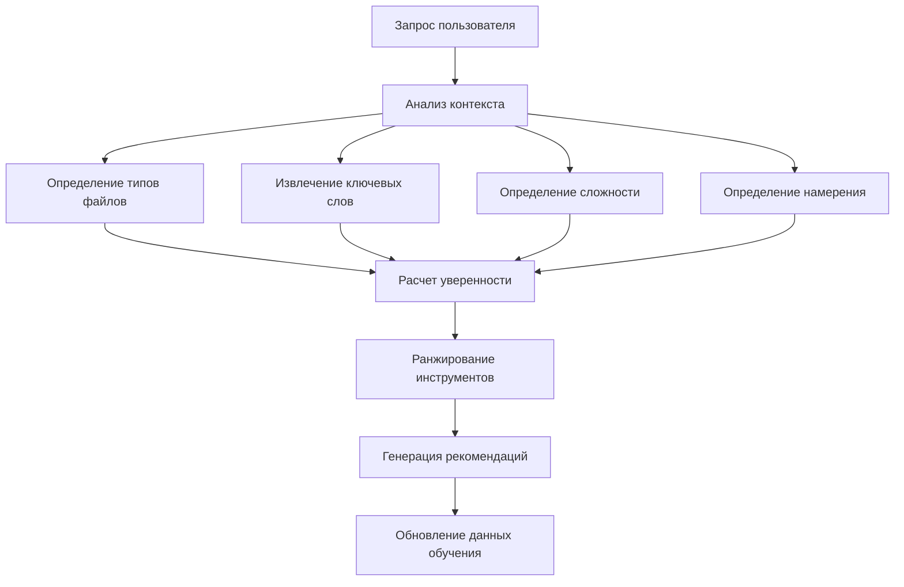

# Dynamic Context Engine Integration Guide

## 🎯 Обзор

Dynamic Context Engine - это система интеллектуального выбора MCP инструментов для фреймворка 1C-Enterprise, которая автоматически анализирует контекст запроса пользователя и предлагает наиболее подходящие инструменты.

## 🚀 Быстрый старт

### 1. Автоматический анализ запроса
```bash
python scripts/mcp-integration/quick-context-analyze.py "Найди все функции в модуле ObjectModule.bsl" --files "src/module.bsl"
```

### 2. Полный анализ с отчетом
```python
from dynamic_context_engine import DynamicContextEngine

engine = DynamicContextEngine()
context = engine.analyze_request("Найди функции", ["file.bsl"])
recommendations = engine.recommend_tools(context)
report = engine.generate_recommendation_report(context, recommendations)
```

## 🧠 Архитектура системы

### Основные компоненты

1. **TaskContext** - контекст задачи с анализом запроса
2. **ToolRecommendation** - рекомендация по использованию инструмента
3. **DynamicContextEngine** - основной движок анализа
4. **Learning System** - система самообучения

### Алгоритм работы



## 📊 Система весов и приоритизации

### Веса для расчета уверенности
```json
{
  "file_type_match": 0.4,      // 40% - соответствие типа файла
  "semantic_match": 0.3,       // 30% - семантическое совпадение
  "complexity_match": 0.2,     // 20% - соответствие сложности
  "learning_bonus": 0.1        // 10% - бонус от обучения
}
```

### Пороги уверенности
- **Высокая (>= 0.8)**: Настоятельно рекомендуется
- **Средняя (>= 0.6)**: Рекомендуется с осторожностью
- **Низкая (>= 0.4)**: Альтернативный вариант

## 🔧 Конфигурация

### Основной файл конфигурации
**Путь:** `.claude/dynamic-context-config.json`

```json
{
  "version": "1.0",
  "weights": { /* веса приоритизации */ },
  "confidence_thresholds": { /* пороги уверенности */ },
  "tool_availability": { /* доступность инструментов */ },
  "bsl_specific": {
    "mandatory_ast_grep": true,
    "ast_grep_confidence_boost": 0.3
  }
}
```

### Паттерны выбора инструментов

Engine использует предопределенные паттерны для каждого типа задач:

- **bsl_structure_analysis** - анализ структуры BSL
- **bsl_function_search** - поиск функций/процедур
- **dependency_analysis** - анализ зависимостей
- **documentation_search** - поиск в документации
- **web_scraping** - парсинг веб-сайтов
- **document_conversion** - конвертация документов

## 📈 Self-Learning система

### Механизм обучения

1. **Сбор данных** - сохранение истории рекомендаций
2. **Анализ успешности** - отслеживание использованных инструментов
3. **Корректировка весов** - автоматическое улучшение алгоритма
4. **Персистентное хранение** - сохранение знаний между сессиями

### Файлы данных обучения
- `cache/context-engine/learning_data.json` - история рекомендаций
- `cache/context-engine/test_report_*.md` - отчеты тестирования

## 🎯 Практические примеры

### Пример 1: Анализ BSL модуля
```python
# Запрос: "Покажи структуру модуля ObjectModule.bsl"
# Результат: mcp__ast-grep-mcp__ast_grep (уверенность: 0.90)

mcp__ast-grep-mcp__ast_grep({
  "pattern": "Функция $NAME($$$ARGS)",
  "bsl_type": "functions",
  "path": "src/ObjectModule.bsl"
})
```

### Пример 2: Поиск зависимостей
```python
# Запрос: "Где используется функция ЗаполнитьСписок?"
# Результат: mcp__serena__find_referencing_symbols (уверенность: 0.85)

mcp__serena__find_referencing_symbols({
  "name_path": "ЗаполнитьСписок",
  "relative_path": "Module.bsl"
})
```

### Пример 3: Парсинг документации
```python
# Запрос: "Парсинг статьи с ITS 1C"
# Результат: mcp__universal-web-scraper__scrape_website (уверенность: 0.95)

mcp__universal-web-scraper__scrape_website({
  "url": "https://its.1c.ru/article",
  "adapter_type": "its_1c",
  "save_to_memory": true
})
```

## 🔄 Интеграция с существующими системами

### Связь с MCP Priority Rules
Engine расширяет существующие правила приоритизации из `.claude/mcp-priority-rules.md`:
- Автоматизирует выбор инструментов
- Добавляет интеллектуальный анализ контекста
- Сохраняет совместимость с ручными правилами

### Интеграция с CLAUDE.md
После запуска `dynamic-context-integration.py` в CLAUDE.md добавляется:
- Секция с описанием Dynamic Context Engine
- Автоматические рекомендации для типовых задач
- Примеры использования и конфигурации

## 📋 Метрики и мониторинг

### Ключевые метрики
- **Точность рекомендаций** - процент успешных предложений
- **Время анализа** - скорость обработки запроса
- **Использование инструментов** - статистика применения MCP
- **Обучение системы** - прогресс алгоритма

### Логирование
```python
import logging
logging.basicConfig(level=logging.INFO)
```

## 🚀 Развитие и улучшения

### Запланированные функции (v1.1)
- [ ] Интеграция с внешними LLM для улучшения анализа
- [ ] Поддержка пользовательских паттернов
- [ ] Расширенная аналитика использования
- [ ] API для интеграции с другими инструментами

### Возможности расширения
- Добавление новых типов файлов
- Создание доменно-специфических правил
- Интеграция с системами мониторинга
- Экспорт рекомендаций в различные форматы

## 🔧 Устранение неполадок

### Частые проблемы

1. **Низкая уверенность рекомендаций**
   - Проверить соответствие ключевых слов в запросе
   - Настроить веса в конфигурации
   - Добавить новые паттерны для специфических задач

2. **Отсутствие рекомендаций**
   - Убедиться в доступности инструментов
   - Проверить корректность типов файлов
   - Добавить fallback инструменты

3. **Медленная работа**
   - Включить кэширование рекомендаций
   - Оптимизировать регулярные выражения
   - Ограничить количество анализируемых паттернов

### Диагностика
```bash
# Тестирование с подробным логированием
PYTHONIOENCODING=utf-8 python scripts/mcp-integration/dynamic-context-engine.py --debug

# Проверка конфигурации
python -c "
from dynamic_context_engine import DynamicContextEngine
engine = DynamicContextEngine()
print('Config loaded:', engine.config['version'])
"
```

---

**Версия документации:** 1.0
**Последнее обновление:** 2025-10-26
**Поддержка:** D:/1C-Enterprise_Framework/scripts/mcp-integration/
