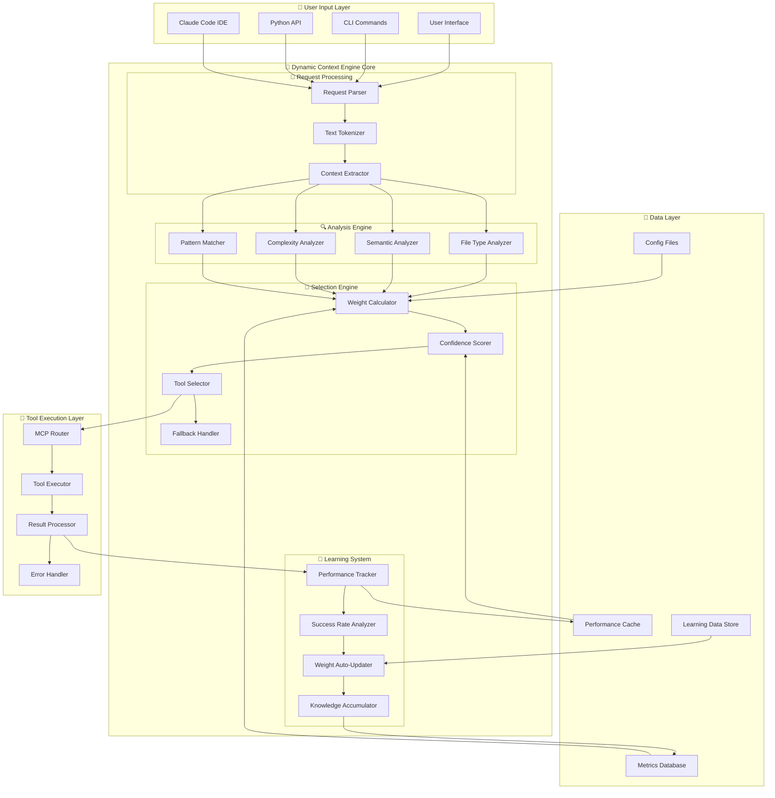
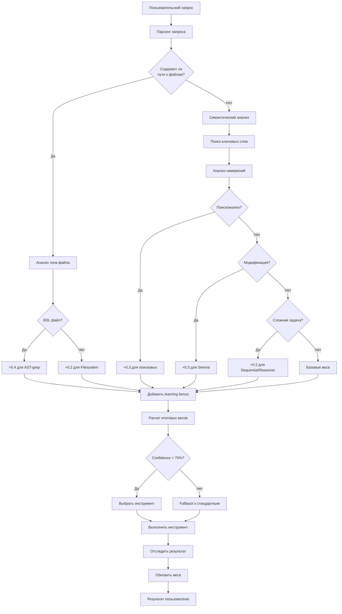
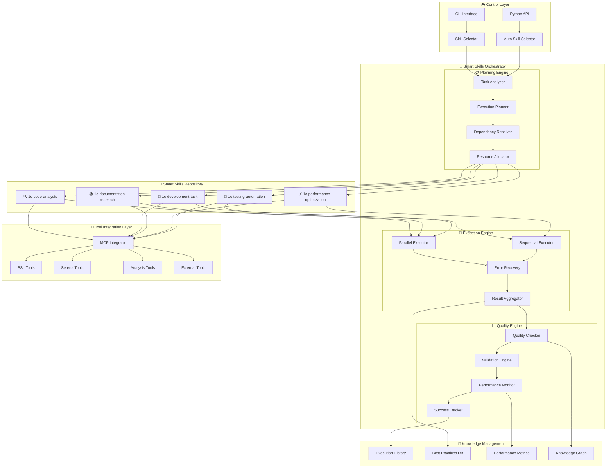
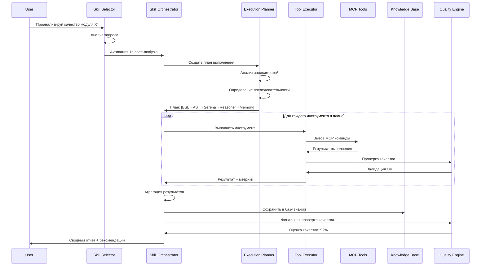
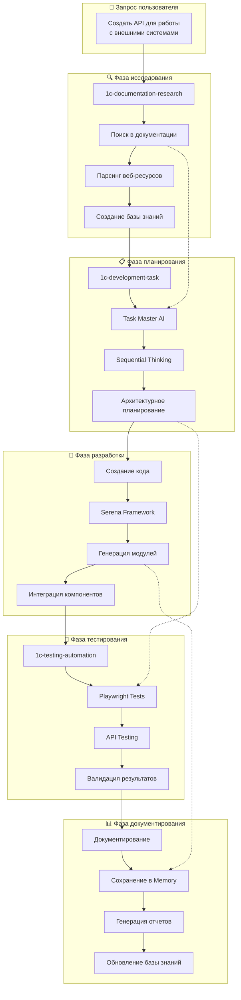
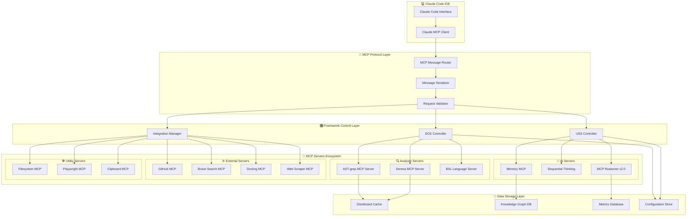
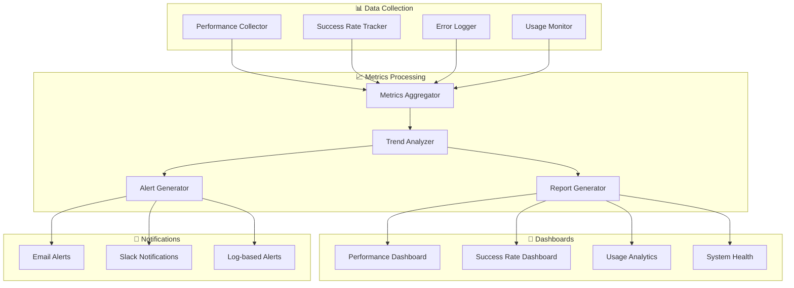
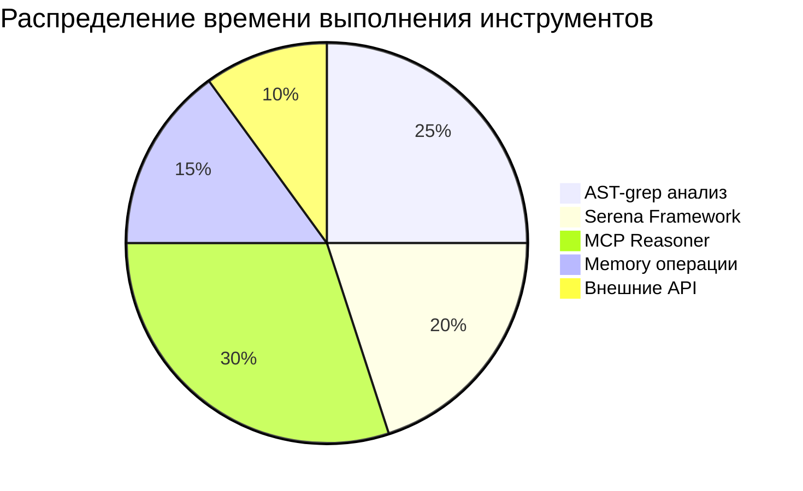
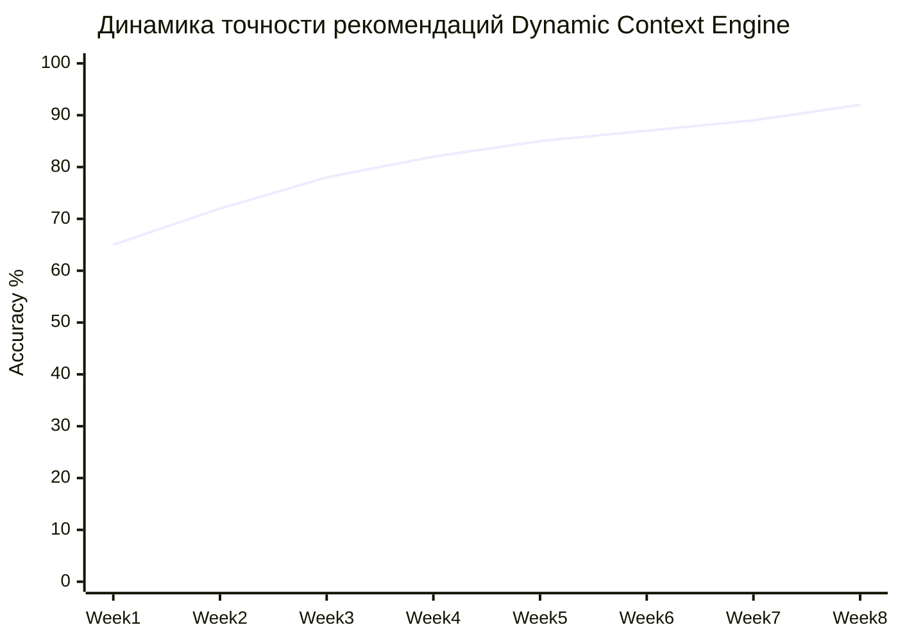

# 🏗️ Архитектурные диаграммы интеграции Modern AI Framework

📍 **Навигация:** [🏠 Главная](../README.md) | [📖 Руководство по внедрению](../implementation-guide.md)  
📅 **Обновлено:** 27.10.2025 | **Статус:** ✅ Детальные схемы архитектуры

---

## 🎯 Обзор архитектуры

Данный документ содержит детальные архитектурные диаграммы для понимания принципов работы и интеграции **Dynamic Context Engine** и **Unified Smart Skills**.

---

## 🤖 Dynamic Context Engine - Архитектура

### **Общая схема работы**



### **Алгоритм выбора инструмента**



---

## 🧠 Unified Smart Skills - Архитектура

### **Схема оркестрации навыков**



### **Детальная схема выполнения навыка**



---

## 🔄 Интеграционные workflow

### **Workflow 1: Полный анализ BSL модуля**

```mermaid
graph LR
    subgraph "🎯 Инициация"
        USER[Пользователь:<br/>"Анализ ObjectModule.bsl"]
        DCE[Dynamic Context<br/>Engine]
        USS[Unified Smart<br/>Skills]
    end
    
    subgraph "🔍 Анализ качества кода"
        BSL[BSL Language<br/>Server]
        AST[AST-grep<br/>Structure Analysis]
        SERENA[Serena Framework<br/>Dependencies]
    end
    
    subgraph "🧠 Глубокий анализ"
        REASONER[MCP Reasoner<br/>Architecture]
        SEQUENTIAL[Sequential Thinking<br/>Planning]
    end
    
    subgraph "💾 Сохранение знаний"
        MEMORY[Memory MCP<br/>Knowledge Graph]
        REPORTS[Отчеты<br/>и метрики]
    end
    
    USER --> DCE
    DCE -->|95% confidence<br/>BSL file detected| USS
    USS -->|1c-code-analysis<br/>skill activated| BSL
    
    BSL -->|Quality issues:<br/>5 MAJOR, 2 MINOR| AST
    AST -->|Found 15 functions<br/>3 procedures| SERENA
    SERENA -->|12 dependencies<br/>2 circular refs| REASONER
    
    REASONER -->|Architecture analysis<br/>Performance issues| SEQUENTIAL
    SEQUENTIAL -->|Action plan:<br/>3 refactoring steps| MEMORY
    
    MEMORY -->|Entities created<br/>Relations mapped| REPORTS
    REPORTS -->|Final report<br/>Recommendations| USER
    
    %% Styling
    classDef userStyle fill:#e1f5fe,stroke:#01579b,stroke-width:2px
    classDef engineStyle fill:#f3e5f5,stroke:#4a148c,stroke-width:2px
    classDef analysisStyle fill:#e8f5e8,stroke:#1b5e20,stroke-width:2px
    classDef deepStyle fill:#fff3e0,stroke:#e65100,stroke-width:2px
    classDef knowledgeStyle fill:#fce4ec,stroke:#880e4f,stroke-width:2px
    
    class USER userStyle
    class DCE,USS engineStyle
    class BSL,AST,SERENA analysisStyle
    class REASONER,SEQUENTIAL deepStyle
    class MEMORY,REPORTS knowledgeStyle
```

### **Workflow 2: Исследование и разработка**



---

## 🔧 Техническая архитектура интеграции

### **MCP Infrastructure**



### **Схема развертывания**

```mermaid
deployment
    node "🖥️ Developer Workstation" {
        component "Claude Code IDE" as CLAUDE
        component "Framework Scripts" as SCRIPTS
        component "Local Cache" as CACHE
    }
    
    node "🔧 MCP Servers Node" {
        component "AST-grep Server" as AST
        component "Serena Server" as SERENA
        component "Memory Server" as MEMORY
        component "Reasoner Server" as REASONER
    }
    
    node "🌐 External Services" {
        component "GitHub API" as GITHUB
        component "Brave Search API" as BRAVE
        component "1C Documentation" as DOCS
    }
    
    node "💾 Data Storage" {
        database "Knowledge Graph" as KG
        database "Performance Metrics" as METRICS
        database "Configuration" as CONFIG
        database "Cache Store" as CACHE_DB
    }
    
    CLAUDE --> AST : MCP Protocol
    CLAUDE --> SERENA : MCP Protocol
    CLAUDE --> MEMORY : MCP Protocol
    CLAUDE --> REASONER : MCP Protocol
    
    SCRIPTS --> CACHE : File I/O
    
    AST --> CONFIG : Read Config
    SERENA --> KG : Store Analysis
    MEMORY --> KG : Graph Operations
    REASONER --> METRICS : Performance Data
    
    SERENA --> GITHUB : API Calls
    REASONER --> BRAVE : Search Queries
    MEMORY --> DOCS : Documentation Fetch
    
    AST --> CACHE_DB : Result Cache
    SERENA --> CACHE_DB : Analysis Cache
    MEMORY --> CACHE_DB : Query Cache
```

---

## 📊 Мониторинг и метрики

### **Система мониторинга**



### **Схема метрик производительности**





---

## 🎯 Практические рекомендации по архитектуре

### **Принципы проектирования**

1. **Модульность**
   - Каждый компонент можно заменить независимо
   - Четкие интерфейсы между слоями
   - Минимальная связанность компонентов

2. **Масштабируемость**
   - Горизонтальное масштабирование MCP серверов
   - Распределенное кэширование результатов
   - Параллельное выполнение инструментов

3. **Надежность**
   - Fallback механизмы для каждого компонента
   - Graceful degradation при отказах
   - Автоматическое восстановление

4. **Производительность**
   - Кэширование на всех уровнях
   - Оптимизация запросов к внешним API
   - Ленивая инициализация компонентов

### **Паттерны интеграции**

1. **Command Pattern** - для выполнения MCP команд
2. **Strategy Pattern** - для выбора алгоритмов анализа
3. **Observer Pattern** - для мониторинга и метрик
4. **Factory Pattern** - для создания инструментов
5. **Adapter Pattern** - для интеграции с внешними API

---

## 🔗 Ссылки на техническую документацию

- 📖 **[Dynamic Context Engine](01-dynamic-context-engine.md)** - детальная техническая документация
- 🧠 **[Unified Smart Skills](02-unified-smart-skills.md)** - подробное описание навыков
- 🔧 **[Интеграция систем](README.md)** - общий обзор архитектуры
- 📊 **[Руководство по внедрению](../implementation-guide.md)** - практическое руководство

---

**📅 Версия:** 1.0 ARCHITECTURAL COMPLETE  
**🗓️ Дата:** 27.10.2025  
**👤 Архитектор:** Claude Code Architecture Team  
**🎯 Статус:** ✅ Готово для технических команд

*Архитектурные диаграммы Modern AI Framework - ваш технический путеводитель по системе.*