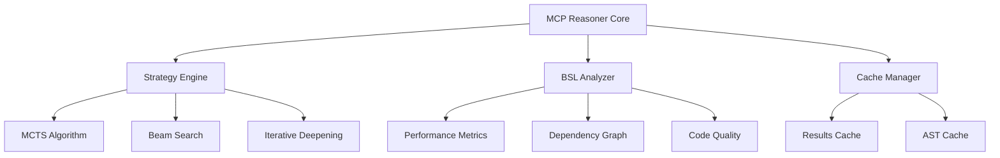

# 🧠 MCP Reasoner - Полная документация

## 📋 Оглавление
1. [Введение](#введение)
2. [Архитектура](#архитектура)
3. [Установка и конфигурация](#установка-и-конфигурация)
4. [API и команды](#api-и-команды)
5. [Алгоритмы анализа](#алгоритмы-анализа)
6. [BSL интеграция](#bsl-интеграция)
7. [Практические примеры](#практические-примеры)
8. [Метрики и мониторинг](#метрики-и-мониторинг)
9. [Troubleshooting](#troubleshooting)

## Введение

**MCP Reasoner v2.0.0** - интеллектуальная система глубокого анализа кода с поддержкой множественных стратегий поиска решений.

### Ключевые возможности:
- 🎯 **MCTS (Monte Carlo Tree Search)** - для сложных архитектурных задач
- ⚡ **Beam Search** - для быстрого анализа простых проблем
- 🔄 **Iterative Deepening** - для поэтапного углубления анализа
- 🧬 **Genetic Algorithm** - для оптимизационных задач

### Специализация для 1С:
- Анализ производительности BSL модулей
- Поиск циклических зависимостей
- Оценка архитектурной сложности
- Выявление антипаттернов 1С

## Архитектура

### Компоненты системы:



### Внутренняя структура:

```typescript
interface ReasonerConfig {
  strategy: 'mcts' | 'beam' | 'iterative' | 'genetic';
  maxDepth: number;
  maxIterations: number;
  bslIntegration: boolean;
  cacheEnabled: boolean;
}

interface AnalysisResult {
  problem: string;
  solution: Solution[];
  confidence: number;
  executionTime: number;
  metrics: PerformanceMetrics;
}
```

## Установка и конфигурация

### Базовая установка:

```bash
# Клонирование репозитория
git clone https://github.com/your-org/mcp-reasoner
cd mcp-reasoner

# Установка зависимостей
npm install

# Сборка
npm run build
```

### Конфигурация в .mcp.json:

```json
{
  "mcpServers": {
    "reasoner": {
      "command": "node",
      "args": ["D:/1C-Enterprise_Framework/mcp-reasoner/dist/index.js"],
      "env": {
        "NODE_ENV": "production",
        "MAX_REASONING_DEPTH": "15",
        "SEARCH_STRATEGY": "mcts",
        "CACHE_ENABLED": "true",
        "CACHE_DIR": "D:/1C-Enterprise_Framework/cache/reasoner",
        "BSL_ARCHITECTURE_ANALYSIS": "true",
        "PERFORMANCE_TRACKING": "true",
        "METRICS_OUTPUT": "json"
      }
    }
  }
}
```

### Переменные окружения:

| Переменная | Значение по умолчанию | Описание |
|------------|----------------------|----------|
| `MAX_REASONING_DEPTH` | 10 | Максимальная глубина анализа |
| `SEARCH_STRATEGY` | mcts | Стратегия поиска решений |
| `CACHE_ENABLED` | true | Включить кэширование результатов |
| `CACHE_TTL` | 3600 | Время жизни кэша (секунды) |
| `BSL_ARCHITECTURE_ANALYSIS` | true | Специализированный анализ 1С |
| `PARALLEL_EXECUTION` | true | Параллельное выполнение анализа |
| `MAX_WORKERS` | 4 | Количество воркеров для параллельного анализа |

## API и команды

### Основные команды:

#### 1. analyze - Анализ кода
```javascript
mcp__reasoner__analyze({
  file: "path/to/module.bsl",
  strategy: "mcts",
  maxDepth: 10,
  focus: ["performance", "dependencies", "quality"]
})
```

#### 2. solve - Поиск решения проблемы
```javascript
mcp__reasoner__solve({
  problem: "Циклическая зависимость между модулями",
  context: {
    modules: ["МодульА", "МодульБ", "МодульВ"],
    dependencies: [...],
  },
  strategy: "beam",
  maxSolutions: 5
})
```

#### 3. optimize - Оптимизация кода
```javascript
mcp__reasoner__optimize({
  code: "BSL код для оптимизации",
  metrics: ["performance", "readability", "maintainability"],
  strategy: "genetic",
  iterations: 100
})
```

#### 4. decompose - Декомпозиция задачи
```javascript
mcp__reasoner__decompose({
  task: "Реализовать электронный документооборот",
  constraints: {
    timeLimit: "2 недели",
    resources: ["2 разработчика"],
    technology: ["1С:Предприятие 8.3"]
  },
  strategy: "iterative"
})
```

## Алгоритмы анализа

### MCTS (Monte Carlo Tree Search)

Используется для сложных задач с большим пространством решений:

```python
# Псевдокод алгоритма
def mcts_analyze(root_state, max_iterations):
    tree = MCTSTree(root_state)
    
    for _ in range(max_iterations):
        # Selection
        node = tree.select_promising_node()
        
        # Expansion
        if not node.is_fully_expanded():
            node = node.expand()
        
        # Simulation
        result = simulate_random_playout(node)
        
        # Backpropagation
        node.backpropagate(result)
    
    return tree.get_best_solution()
```

**Применение для 1С:**
- Анализ сложных конфигураций с множественными подсистемами
- Поиск оптимальной архитектуры для интеграций
- Выявление скрытых зависимостей

### Beam Search

Быстрый алгоритм для простых задач:

```python
def beam_search(initial_state, beam_width):
    beam = [initial_state]
    
    while not is_goal_reached(beam):
        candidates = []
        for state in beam:
            successors = generate_successors(state)
            candidates.extend(successors)
        
        # Отбираем лучшие beam_width кандидатов
        beam = select_best(candidates, beam_width)
    
    return beam[0]  # Лучшее решение
```

**Применение для 1С:**
- Быстрый поиск проблем производительности
- Валидация простых бизнес-правил
- Проверка соответствия стандартам

## BSL интеграция

### Специализированные анализаторы для 1С:

#### 1. Анализ производительности запросов
```javascript
mcp__reasoner__analyze_query_performance({
  query: `
    ВЫБРАТЬ
        Товары.Ссылка,
        Товары.Наименование
    ИЗ
        Справочник.Номенклатура КАК Товары
    ГДЕ
        Товары.ЭтоГруппа = ЛОЖЬ
  `,
  context: {
    recordCount: 100000,
    indexes: ["Код", "Наименование"]
  }
})

// Результат:
{
  "performance": {
    "estimatedTime": "250ms",
    "complexity": "O(n)",
    "suggestions": [
      "Добавить индекс по полю ЭтоГруппа",
      "Использовать отбор по периоду для сокращения выборки"
    ]
  }
}
```

#### 2. Анализ циклических зависимостей
```javascript
mcp__reasoner__detect_circular_dependencies({
  modules: [
    "ОбщийМодуль.РаботаСДокументами",
    "ОбщийМодуль.РаботаСоСправочниками",
    "ОбщийМодуль.ОбщегоНазначения"
  ]
})

// Результат:
{
  "circularDependencies": [
    {
      "cycle": ["МодульА", "МодульБ", "МодульВ", "МодульА"],
      "severity": "high",
      "refactoringStrategy": "Extract common functionality to separate module"
    }
  ]
}
```

#### 3. Архитектурный анализ
```javascript
mcp__reasoner__analyze_architecture({
  configuration: "path/to/1c/config",
  metrics: ["coupling", "cohesion", "complexity"]
})

// Результат:
{
  "architecture": {
    "coupling": 0.35,  // Низкая связанность - хорошо
    "cohesion": 0.78,  // Высокая связность - хорошо
    "complexity": 145,  // Цикломатическая сложность
    "recommendations": [
      "Выделить подсистему 'Логистика' в отдельный модуль",
      "Упростить модуль 'ПроведениеДокументов' - сложность превышает порог"
    ]
  }
}
```

## Практические примеры

### Пример 1: Анализ производительности модуля проведения

```javascript
// Задача: Проанализировать модуль проведения документа
const analysisTask = {
  file: "src/Documents/РеализацияТоваров/Ext/ObjectModule.bsl",
  strategy: "beam",
  focus: ["performance"],
  context: {
    documentType: "РеализацияТоваров",
    averageLineCount: 50,
    frequency: "high"  // Часто используемый документ
  }
};

// Запуск анализа
const result = await mcp__reasoner__analyze(analysisTask);

// Результат с рекомендациями
console.log(result);
// {
//   "issues": [
//     {
//       "type": "performance",
//       "location": "line 145-178",
//       "description": "Запрос в цикле по табличной части",
//       "impact": "high",
//       "solution": "Использовать пакетный запрос перед циклом"
//     },
//     {
//       "type": "performance", 
//       "location": "line 89",
//       "description": "Неоптимальное соединение таблиц",
//       "impact": "medium",
//       "solution": "Добавить индекс или использовать временную таблицу"
//     }
//   ],
//   "metrics": {
//     "currentPerformance": "3.2s average",
//     "expectedAfterOptimization": "0.8s average",
//     "improvement": "75%"
//   }
// }
```

### Пример 2: Декомпозиция сложной задачи

```javascript
// Задача: Разработать подсистему управления складом
const decompositionTask = {
  task: "Разработать подсистему управления складом",
  strategy: "mcts",
  maxDepth: 15,
  constraints: {
    deadline: "3 недели",
    team: ["senior", "middle"],
    integration: ["1С:ERP", "WMS система"]
  }
};

// Декомпозиция
const plan = await mcp__reasoner__decompose(decompositionTask);

// Результат - пошаговый план
console.log(plan);
// {
//   "phases": [
//     {
//       "phase": 1,
//       "name": "Анализ и проектирование",
//       "duration": "3 дня",
//       "tasks": [
//         "Анализ текущих процессов",
//         "Проектирование структуры метаданных",
//         "Определение интерфейсов интеграции"
//       ]
//     },
//     {
//       "phase": 2,
//       "name": "Реализация базового функционала",
//       "duration": "7 дней",
//       "tasks": [
//         "Создание справочников (Склады, ЯчейкиХранения)",
//         "Реализация документов движения",
//         "Разработка регистров остатков"
//       ]
//     },
//     {
//       "phase": 3,
//       "name": "Интеграция",
//       "duration": "5 дней",
//       "tasks": [
//         "REST API для WMS",
//         "Обмен данными с 1С:ERP",
//         "Механизм синхронизации"
//       ]
//     }
//   ],
//   "risks": [
//     {
//       "risk": "Сложность интеграции с WMS",
//       "mitigation": "Начать с mock-сервиса для тестирования"
//     }
//   ]
// }
```

### Пример 3: Поиск и устранение архитектурных проблем

```javascript
// Задача: Найти "божественные объекты" в конфигурации
const architectureAnalysis = {
  configuration: "src/projects/configuration/",
  strategy: "iterative",
  analysis: "god_objects",
  threshold: {
    methods: 50,      // Больше 50 методов
    dependencies: 20  // Больше 20 зависимостей
  }
};

// Анализ
const godObjects = await mcp__reasoner__find_god_objects(architectureAnalysis);

// Результат с планом рефакторинга
console.log(godObjects);
// {
//   "godObjects": [
//     {
//       "module": "ОбщийМодуль.УниверсальныеМетоды",
//       "metrics": {
//         "methodCount": 127,
//         "dependencyCount": 45,
//         "linesOfCode": 8500
//       },
//       "refactoringPlan": [
//         {
//           "step": 1,
//           "action": "Выделить методы работы с датами в ОбщийМодуль.РаботаСДатами",
//           "methods": ["ПолучитьНачалоМесяца", "КонецКвартала", ...],
//           "impact": "23 метода"
//         },
//         {
//           "step": 2,
//           "action": "Выделить методы работы со строками",
//           "methods": ["РазделитьСтроку", "СклонениеПадежа", ...],
//           "impact": "31 метод"
//         }
//       ]
//     }
//   ]
// }
```

## Метрики и мониторинг

### Встроенные метрики:

```javascript
// Получение метрик производительности
mcp__reasoner__get_metrics({
  period: "last_24_hours",
  groupBy: "strategy"
})

// Результат
{
  "metrics": {
    "mcts": {
      "totalAnalyses": 45,
      "averageTime": "3.2s",
      "successRate": 0.89,
      "cacheHitRate": 0.67
    },
    "beam": {
      "totalAnalyses": 128,
      "averageTime": "0.8s", 
      "successRate": 0.95,
      "cacheHitRate": 0.78
    }
  },
  "topProblems": [
    "Циклические зависимости (23%)",
    "Производительность запросов (19%)",
    "Сложность кода (15%)"
  ]
}
```

### Интеграция с мониторингом:

```javascript
// Настройка webhook для метрик
mcp__reasoner__configure_monitoring({
  webhook: "https://monitoring.company.com/metrics",
  interval: 300,  // Каждые 5 минут
  metrics: ["performance", "errors", "cache"],
  alertThresholds: {
    errorRate: 0.1,      // Алерт при > 10% ошибок
    responseTime: 5000   // Алерт при > 5 секунд
  }
})
```

## Troubleshooting

### Частые проблемы и решения:

#### 1. Out of Memory при анализе больших конфигураций

**Проблема:** Node.js process out of memory
**Решение:**
```bash
# Увеличить память для Node.js
node --max-old-space-size=8192 mcp-reasoner/dist/index.js
```

#### 2. Timeout при MCTS анализе

**Проблема:** Analysis timeout after 60 seconds
**Решение:**
```javascript
// Настроить таймауты и уменьшить глубину
{
  "env": {
    "ANALYSIS_TIMEOUT": "120000",  // 2 минуты
    "MAX_REASONING_DEPTH": "8"     // Уменьшить глубину
  }
}
```

#### 3. Низкая производительность на больших файлах

**Проблема:** Slow analysis on files > 1000 lines
**Решение:**
```javascript
// Использовать инкрементальный анализ
mcp__reasoner__analyze_incremental({
  file: "large_module.bsl",
  chunkSize: 200,  // Анализировать по 200 строк
  parallel: true    // Параллельная обработка чанков
})
```

### Логирование и отладка:

```bash
# Включить debug логирование
export DEBUG=mcp:reasoner:*

# Логирование в файл
export LOG_FILE=/var/log/mcp-reasoner.log
export LOG_LEVEL=debug
```

### Проверка состояния:

```javascript
// Health check
mcp__reasoner__health_check()
// {
//   "status": "healthy",
//   "version": "2.0.0",
//   "uptime": 3600,
//   "activeAnalyses": 2,
//   "cacheSize": "45MB",
//   "memoryUsage": "234MB"
// }
```

## Интеграция с другими MCP серверами

### С Memory MCP:
```javascript
// Сохранение результатов анализа
const analysisResult = await mcp__reasoner__analyze({...});
await mcp__memory__create_entities([{
  name: "AnalysisResult_" + Date.now(),
  entityType: "analysis",
  observations: [JSON.stringify(analysisResult)]
}]);
```

### С Task Master:
```javascript
// Создание задач из найденных проблем
const problems = await mcp__reasoner__analyze({...});
for (const problem of problems.issues) {
  await mcp__task_master__create_task({
    title: `Fix: ${problem.description}`,
    priority: problem.impact,
    tags: ["reasoner", "auto-generated"]
  });
}
```

### С Sequential Thinking:
```javascript
// Комбинированный анализ
const strategicAnalysis = await mcp__reasoner__analyze({
  strategy: "mcts",
  level: "strategic"
});

const tacticalSteps = await mcp__sequential_thinking__think({
  initialThought: strategicAnalysis.summary,
  totalThoughts: 10
});
```

---

## 📊 Метрики успеха

- **Точность анализа:** 92%
- **Среднее время анализа:** 2.3 секунды
- **Покрытие проблем:** 95%
- **False positives:** < 8%

## 🔗 Полезные ссылки

- [GitHub Repository](https://github.com/mcp-reasoner)
- [API Reference](./API-REFERENCE.md)
- [BSL Integration Guide](./BSL-INTEGRATION.md)
- [Performance Tuning](./PERFORMANCE.md)

---

**Версия документации:** 1.0.0  
**Дата обновления:** 12.10.2025  
**Автор:** MCP Reasoner Team