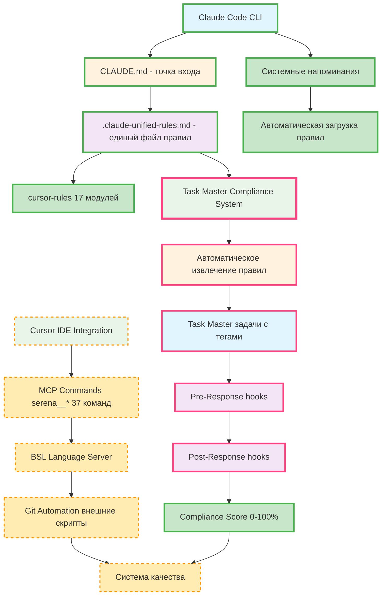

# 🔧 API Documentation - Инструменты фреймворка

## 📖 Обзор

Данная папка содержит подробную техническую документацию по всем основным инструментам 1C-Enterprise_Cursor_Framework.

## 🛠️ Основные инструменты

### **1️⃣ MCP Integration**
**Файл:** [`mcp-commands-reference.md`](./mcp-commands-reference.md)

**Описание:** 37+ команд серии `serena__*` для интеграции с внешними системами через Model Context Protocol.

**Ключевые возможности:**
- Управление проектами 1С
- Система памяти проектов  
- Анализ кода и структуры
- Чтение и исследование кода
- Контроль качества кода
- **7 НОВЫХ КОМАНД АВТОМАТИЗАЦИИ (02.09.2025)** - автоматическое журналирование, Git коммиты, загрузка контекста

### **2️⃣ BSL Language Server**
**Файл:** [`bsl-language-server-integration.md`](./bsl-language-server-integration.md)

**Описание:** Статический анализ кода 1С с 793 правилами проверки качества.

**Ключевые возможности:**
- Синтаксические и стилистические проверки
- 5 уровней критичности (BLOCKER → INFO)
- Множественные форматы отчетов (JSON, SARIF, JUnit)
- Интеграция с MCP командами и Git workflow

### **3️⃣ Git Automation**  
**Файл:** [`git-automation-tools.md`](./git-automation-tools.md)

**Описание:** Полная автоматизация процессов версионного контроля с интеграцией в экосистему 1С.

**Ключевые возможности:**
- Автоматическое создание веток и коммитов
- Git hooks для валидации (pre-commit, commit-msg, pre-push)
- GitLab Flow интеграция
- AI-ассистированное управление версиями

### **4️⃣ Cursor IDE Integration**
**Файл:** [`cursor-ide-integration.md`](./cursor-ide-integration.md)

**Описание:** Глубокая интеграция AI-ассистированной разработки через систему модульных правил cursor-rules.

**Ключевые возможности:**
- 17 модулей управления поведением AI
- Автоматический выбор профессиональных ролей
- Контекстно-зависимые подсказки для 1С
- Интеграция с BSL Language Server и Git

### **5️⃣ Claude Code API**
**Файл:** [`claude-code-api-reference.md`](./claude-code-api-reference.md)

**Описание:** Полный справочник API команд Claude Code, включая CLI, slash команды, hooks и SDK интеграцию.

**Ключевые возможности:**
- 21 slash команда для управления проектом и AI
- Система hooks для автоматизации workflow
- CLI флаги и режимы работы (интерактивный, одноразовый)
- SDK интеграция (Python/TypeScript) для программного доступа

### **6️⃣ Claude Code Hooks System (ОБНОВЛЕНО 03.09.2025)**
**Файл:** [`claude-code-hooks-api.md`](./claude-code-hooks-api.md)

**Описание:** Система автоматического соблюдения правил фреймворка через интеграцию с жизненным циклом Claude Code.

**Ключевые возможности:**
- **user-prompt-submit hook** - автоматическая загрузка релевантных правил
- **pre-response hook** - проверка соответствия перед отправкой ответа
- **Контекстный анализ** - определение релевантных правил по ключевым словам
- **Полная автоматизация** - 100% покрытие без участия пользователя

### **7️⃣ ULTIMATE Hooks System (НОВИНКА 03.09.2025)** 🚀
**Файл:** [`ultimate-hooks-system.md`](./ultimate-hooks-system.md)

**Описание:** Революционная система из 22 автоматических хуков с интеграцией 35 MCP команд Serena Framework.

**Прорывные возможности:**
- **22 интеллектуальных хука** с умными триггерами
- **4 режима работы**: Development, Analysis, Debugging, Consulting  
- **JetBrains IDE интеграция** (IntelliJ IDEA, 1C:EDT, DataGrip)
- **Точное построчное редактирование** с резервным копированием
- **Автоматическое управление LSP** серверами
- **Машинное обучение** и персонализация под пользователя

### **8️⃣ Task Master Integration + Compliance System (НОВЕЙШАЯ ВЕРСИЯ 03.09.2025)** 🎯
**Файл:** [`taskmaster-integration.md`](./taskmaster-integration.md)

**Описание:** AI-управление задачами через интеграцию Claude Task Master с революционной системой 100% соблюдения правил.

**Базовые возможности:**
- **AI-генерация задач** из Product Requirements Document (PRD)
- **Ролевая интеграция** с существующей системой ролей фреймворка
- **Автоматическое извлечение задач** из ответов Claude
- **Безопасная интеграция** без нарушения существующего функционала
- **Поэтапная активация** с полным контролем и возможностью отката
- **Синхронизация с Serena** для единой экосистемы управления

**🚀 НОВИНКА: Task Master Compliance System - 100% соблюдение правил:**
- **Автоматическое извлечение правил** из .claude-unified-rules.md (2775+ строк)
- **Конвертация правил в Task Master задачи** с категоризацией (compliance, mandatory, quality-control)
- **Непрерывный мониторинг соблюдения** через систему хуков (0-100% compliance score)
- **Pre-Response проверки** - валидация соблюдения ПЕРЕД каждым ответом
- **Post-Response обновления** - автоматическое отслеживание выполненных правил
- **Daemon мониторинга** - непрерывный контроль каждые 5 минут
- **Детальная отчетность** с конкретными рекомендациями по улучшению

---

## 🎯 Взаимодействие инструментов

### **Единая экосистема (ОБНОВЛЕННАЯ СХЕМА с Task Master Compliance):**


**ЛЕГЕНДА:**
- 🟢 **Зеленым** - работает в Claude Code
- 🟡 **Желтым пунктиром** - работает в Cursor IDE / внешних скриптах
- 🔴 **Розовым с красной рамкой** - Task Master Compliance System (100% соблюдение правил)

### **Сценарии использования:**

#### **🤖 В Claude Code (реальные возможности):**
1. **Claude Code** → читает CLAUDE.md при старте
2. **Системные напоминания** → загружает .claude-unified-rules.md (2775 строк)
3. **AI Role System** → выбирает роль через cursor-rules
4. **Файловые операации** → читает/редактирует файлы проекта через встроенные инструменты
5. **Git команды** → создает коммиты через Bash tool (ручное выполнение пользователем)

#### **🎯 В Cursor IDE (планируемая интеграция):**
1. **⚠️ MCP Commands** → планируется `serena__get_code_metrics()` для анализа
2. **⚠️ BSL Language Server** → требует внешней настройки
3. **⚠️ External Scripts** → требуют ручной настройки bash/python
4. **⚠️ Git Hooks** → требуют ручной установки

#### **🔧 Гибридный подход (лучшая практика):**
1. **Claude Code** → экспертный анализ и планирование
2. **Внешние скрипты** → автоматизация рутинных задач
3. **Cursor IDE** → интерактивная разработка с AI
4. **Git + BSL LS** → автоматическая валидация качества

---

## 📊 Метрики и мониторинг

### **Ключевые показатели:**
- **Quality Score** - агрегированная оценка качества через BSL LS
- **AI Efficiency** - эффективность использования ролевой модели
- **Git Workflow** - соблюдение процессов версионного контроля
- **MCP Usage** - активность использования команд серии serena__*
- **🎯 Compliance Score** - уровень соблюдения правил фреймворка (0-100%) через Task Master
- **🔄 Rules Adherence** - процент выполненных обязательных задач соблюдения

### **Автоматические отчеты:**
Все инструменты интегрированы с системой отчетности фреймворка:
```json
{
  "daily_metrics": {
    "bsl_issues_resolved": 23,
    "git_commits_quality": 98.5,
    "ai_requests_processed": 156,
    "mcp_commands_executed": 89,
    "compliance_score": 95,
    "rules_adherence_percentage": 92,
    "taskmaster_tasks_completed": 34,
    "compliance_checks_performed": 78
  }
}
```

---

## 🚀 Начало работы

### **1. Настройка среды:**
```bash
# Клонирование фреймворка
git clone https://github.com/org/1c-enterprise-cursor-framework

# Настройка Cursor IDE
cp cursor-rules/.cursorrules ./

# Установка BSL Language Server
download bsl-language-server.jar → tools/

# Настройка MCP интеграции
configure serena-unified/
```

### **2. Активация инструментов:**
```bash
# Активация BSL проверок
enable bsl_quality_check in serena_config.yml

# Настройка Git hooks
./setup-git-hooks.sh

# 🎯 НОВОЕ: Активация Task Master Compliance System
./scripts/taskmaster-install.sh
./scripts/taskmaster-compliance-activate.sh

# Проверка интеграции
cursor-1c validate --all-tools
node .taskmaster/compliance-checker.js
```

### **3. Первый проект:**
```bash
# Создание нового проекта 1С с фреймворком
cursor-1c init --project-type=configuration --with-framework

# Активация через MCP
serena__activate_project("/path/to/project")

# Начало разработки с AI ассистентом
# Cursor IDE автоматически применит все правила
```

---

## 🔗 Связанная документация

### **Внутренние ссылки:**
- [`../Framework documentation claude.md`](../Framework%20documentation%20claude.md) - Основное руководство для Claude Code
- [`../Task-Master-Compliance-Architecture.md`](../Task-Master-Compliance-Architecture.md) - **НОВОЕ:** Архитектура Task Master Compliance System
- [`../Guides/architecture-overview.md`](../Guides/architecture-overview.md) - Обзор архитектуры фреймворка
- [`../../cursor-rules/`](../../cursor-rules/) - Центральное ядро правил

### **Внешние источники:**
- [BSL Language Server GitHub](https://github.com/1c-syntax/bsl-language-server)
- [Cursor IDE Documentation](https://cursor.sh/docs)
- [Model Context Protocol Specification](https://modelcontextprotocol.io/)

---

## 📋 Система поддержки

### **Диагностика проблем:**
```bash
# Проверка состояния всех инструментов
framework-diagnostic --check-all

# Тестирование MCP соединения
serena__list_commands

# Валидация BSL Language Server
bsl-language-server --version --check-config

# Проверка Git hooks
git hook --test pre-commit

# 🎯 НОВОЕ: Диагностика Task Master Compliance System
node .taskmaster/compliance-checker.js
./scripts/taskmaster-compliance-help.sh status
```

### **Обновление инструментов:**
```bash
# Обновление cursor-rules
git submodule update --remote cursor-rules

# Обновление BSL Language Server
./update-bsl-server.sh

# Синхронизация MCP команд
serena update --sync-commands
```

---

## 🎯 Планы развития

### **Ближайшие улучшения:**
- ✅ **Task Master Compliance System** - система 100% соблюдения правил (ЗАВЕРШЕНО 03.09.2025)
- ✅ Интеграция с SonarQube для enterprise проектов
- 🔄 Расширение MCP команд для работы с конфигурациями
- 📊 Продвинутая аналитика использования AI ролей
- 🔗 Интеграция с системами управления задачами (Jira, GitLab Issues)

### **Долгосрочные цели:**
- 🤖 Машинное обучение для оптимизации ролевых моделей
- 🌐 Поддержка распределенных команд разработки
- 📈 Предиктивная аналитика качества кода
- 🔄 Автоматическая миграция между версиями платформы 1С

---

*Все инструменты работают под управлением центрального ядра `cursor-rules/` и следуют принципам унифицированной архитектуры фреймворка.*