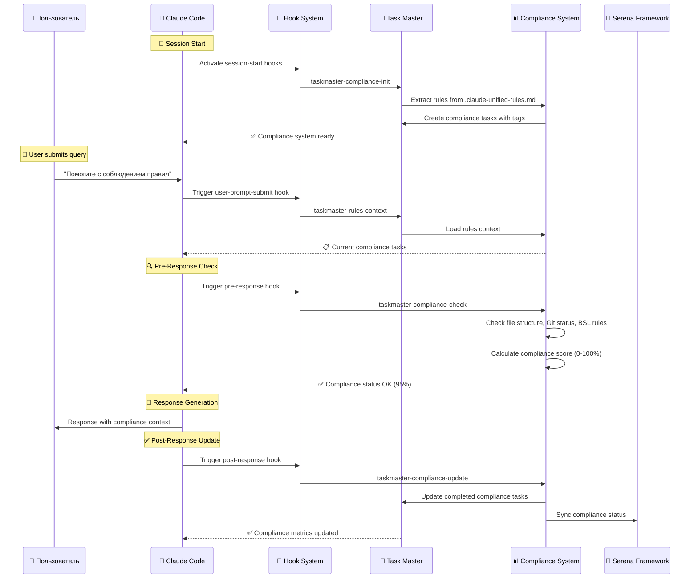

# 🎯 Task Master Compliance System - Архитектурная схема интеграции

## 📖 Обзор архитектуры

**Task Master Compliance System** интегрирована в 1C-Enterprise Cursor Framework как революционная система 100% соблюдения правил, которая автоматически извлекает правила из документации и обеспечивает их принудительное выполнение через AI-управляемые задачи.

## 🏗️ Полная архитектурная схема интеграции

```mermaid
graph TB
    subgraph "🚀 CLAUDE CODE ECOSYSTEM"
        A[Claude Code CLI] --> B[CLAUDE.md - точка входа]
        B --> C[System Reminders]
        C --> D[.claude-unified-rules.md<br/>2775+ строк правил]
        D --> E[cursor-rules 17 модулей]
        E --> F[AI Role System<br/>4 роли + селектор]
    end

    subgraph "🎯 TASK MASTER COMPLIANCE SYSTEM"
        G[Rules Extraction Engine] --> H[AI Rules Parser]
        H --> I[Task Generator<br/>с категоризацией]
        I --> J[Task Master Database]
        
        J --> K[Compliance Checker<br/>compliance-checker.js]
        K --> L[Score Calculator<br/>0-100% compliance]
        
        J --> M[Compliance Monitor Daemon<br/>каждые 5 минут]
        M --> N[Real-time Metrics]
        
        O[Pre-Response Hook] --> K
        P[Post-Response Hook] --> Q[Status Updater]
        Q --> R[Serena Sync Adapter]
        
        S[Rules Context Loader] --> T[Context Provider]
    end

    subgraph "🔧 INTEGRATION LAYER"
        U[Hook Management System]
        V[.claude-code-hooks*.json]
        W[Script Execution Engine]
        X[Error Handling & Logging]
    end

    subgraph "📊 MONITORING & REPORTING"
        Y[Compliance Reports<br/>JSON format]
        Z[Statistics Dashboard]
        AA[Metrics Collector]
        BB[Performance Analytics]
    end

    subgraph "🎣 HOOKS INTEGRATION POINTS"
        CC[session-start]
        DD[user-prompt-submit] 
        EE[pre-response]
        FF[post-response]
    end

    subgraph "🔗 EXTERNAL SYSTEMS"
        GG[Serena Framework MCP]
        HH[BSL Language Server]
        II[Git Automation]
        JJ[File System Operations]
    end

    %% Main Flow Connections
    D --> G
    G --> I
    J --> CC
    CC --> U
    DD --> S
    EE --> O
    FF --> P
    
    %% Integration Connections  
    U --> V
    V --> W
    W --> X
    
    %% Monitoring Connections
    K --> Y
    L --> Y
    M --> AA
    N --> BB
    AA --> Z
    
    %% External Integrations
    R --> GG
    K --> HH
    Q --> II
    W --> JJ

    %% Styling
    style A fill:#e1f5fe,stroke:#01579b,stroke-width:2px
    style D fill:#f3e5f5,stroke:#4a148c,stroke-width:2px
    style G fill:#e8f5e8,stroke:#1b5e20,stroke-width:3px
    style I fill:#fff3e0,stroke:#e65100,stroke-width:2px
    style K fill:#ffebee,stroke:#b71c1c,stroke-width:3px
    style L fill:#e0f2f1,stroke:#00695c,stroke-width:3px
    style M fill:#fce4ec,stroke:#880e4f,stroke-width:2px
    style O fill:#e3f2fd,stroke:#0277bd,stroke-width:3px
    style P fill:#e8f5e8,stroke:#2e7d32,stroke-width:3px

    classDef claudeSystem fill:#e1f5fe,stroke:#01579b,stroke-width:2px
    classDef taskMaster fill:#e8f5e8,stroke:#1b5e20,stroke-width:3px
    classDef compliance fill:#ffebee,stroke:#b71c1c,stroke-width:3px
    classDef hooks fill:#e3f2fd,stroke:#0277bd,stroke-width:2px
    classDef external fill:#f3e5f5,stroke:#4a148c,stroke-width:2px

    class A,B,C,D,E,F claudeSystem
    class G,H,I,J,K,L,M,N taskMaster  
    class O,P,Q,S,T compliance
    class CC,DD,EE,FF hooks
    class GG,HH,II,JJ external
```

## 🔄 Детальный поток выполнения

### 🚀 **1. Инициализация системы (Session Start)**

```
📖 Claude Code читает CLAUDE.md
        ↓
🔄 Системные напоминания загружают .claude-unified-rules.md
        ↓
🎯 Task Master Compliance активируется через session-start hook
        ↓
📋 Rules Extraction Engine извлекает все правила фреймворка
        ↓
🤖 AI Rules Parser анализирует правила и категоризирует их
        ↓
📝 Task Generator создает управляемые задачи с тегами:
    • compliance (общие правила соблюдения)
    • mandatory (обязательные к выполнению)  
    • bsl-compliance (BSL Language Server правила)
    • git-compliance (Git workflow правила)
    • doc-compliance (документация правила)
    • role-compliance (ролевая система правила)
        ↓
✅ Task Master Database готова к мониторингу
```

### 🎯 **2. Pre-Response Compliance Check**

```
👤 Пользователь отправляет запрос
        ↓
🎣 user-prompt-submit hook активируется (если содержит ключевые слова)
        ↓ 
📚 Rules Context Loader загружает актуальные задачи соблюдения
        ↓
🔍 pre-response hook запускает Compliance Checker
        ↓
📊 Compliance Checker выполняет проверки:
    ✅ Структура обязательных файлов
    ✅ Git статус и незакоммиченные изменения
    ✅ Обновление документации  
    ✅ Соответствие BSL правилам
        ↓
🧮 Score Calculator рассчитывает compliance score (0-100%)
        ↓
💬 Claude отвечает с учетом контекста соблюдения правил
```

### ✅ **3. Post-Response Compliance Update** 

```
📝 Claude предоставил ответ
        ↓
🎣 post-response hook активируется
        ↓
📊 Status Updater анализирует выполненные действия:
    • Git коммиты → обновляет git-compliance задачи
    • Записи в журнал → обновляет doc-compliance задачи  
    • Цитаты из документации → обновляет framework-compliance
        ↓
📈 Обновляются метрики в реальном времени
        ↓
🔄 Serena Sync Adapter синхронизирует статус с Serena Framework
        ↓
📋 Task Master обновляет статус выполненных задач соблюдения
```

### 🔄 **4. Непрерывный мониторинг (Daemon)**

```
⏰ Каждые 5 минут Compliance Monitor Daemon:
        ↓
🔍 Проверяет общее состояние соблюдения
        ↓  
📊 Обновляет метрики производительности
        ↓
⚠️ Выявляет нарушения правил
        ↓
📈 Накапливает статистику для аналитики
        ↓
💾 Сохраняет отчеты в JSON формате
```

## 🎣 Детальная схема хуков интеграции

### **Hook Flow Diagram:**



## 📊 Компоненты системы мониторинга

### **1. Compliance Checker (compliance-checker.js)**
```javascript
class FrameworkComplianceChecker {
    checkFileStructureCompliance()    // Структура файлов
    checkGitWorkflowCompliance()      // Git workflow
    checkDocumentationCompliance()   // Документация
    checkCodeQualityCompliance()     // Качество кода
    generateComplianceReport()       // Генерация отчета
    calculateOverallScore()          // Общий score 0-100%
}
```

### **2. Compliance Monitor Daemon (compliance-monitor-daemon.js)**
```javascript
class ComplianceMonitorDaemon {
    performComplianceCheck()         // Периодические проверки
    checkFileStructure()             // Проверка файлов
    checkGitStatus()                 // Проверка Git
    checkTaskMasterStatus()          // Статус Task Master
    updateMetrics()                  // Обновление метрик
}
```

### **3. Task Master Integration Scripts**
```bash
taskmaster-rules-compliance.sh      # Извлечение правил
taskmaster-compliance-activate.sh   # Активация системы
taskmaster-update-compliance.sh     # Обновление статуса
taskmaster-load-rules-context.sh    # Загрузка контекста
taskmaster-compliance-help.sh       # Справка по системе
```

## 🏷️ Система тегов и категоризации

### **Автоматическая категоризация правил:**

| Категория | Task Master Tag | Источник правил | Критичность | Автоматизация |
|-----------|-----------------|-----------------|-------------|---------------|
| **🔧 BSL Quality** | `bsl-compliance` | 793 правила BSL Language Server | BLOCKER | Полная |
| **📋 Git Workflow** | `git-compliance` | Git правила из cursor-rules | CRITICAL | Частичная |  
| **📚 Documentation** | `doc-compliance` | Правила журналирования | MAJOR | Полная |
| **🎭 Role-Based** | `role-compliance` | Ролевая система правила | MAJOR | Полная |
| **🔗 Framework** | `framework-compliance` | Архитектурные принципы | CRITICAL | Полная |
| **⚠️ Mandatory** | `mandatory` | Обязательные требования | BLOCKER | Полная |
| **🎯 Quality Control** | `quality-control` | Чек-листы контроля | MAJOR | Полная |

### **Пример задач соблюдения:**
```bash
# Просмотр задач по категориям
npx task-master list --tag bsl-compliance      # BSL правила
npx task-master list --tag mandatory           # Обязательные
npx task-master list --tag quality-control     # Контроль качества
npx task-master next --tag compliance          # Следующая задача
```

## 📈 Система метрик и отчетности

### **Ключевые метрики compliance:**
```json
{
  "compliance_metrics": {
    "overall_score": 95,
    "categories_breakdown": {
      "file_structure": 100,
      "git_workflow": 85,
      "documentation": 100, 
      "code_quality": 95
    },
    "task_statistics": {
      "total_tasks": 127,
      "completed_tasks": 121,
      "pending_tasks": 6,
      "completion_rate": 95.3
    },
    "performance_metrics": {
      "average_response_time": "1.2s",
      "checks_performed_today": 34,
      "violations_detected": 2,
      "violations_resolved": 2
    }
  }
}
```

### **Автоматические отчеты:**
- **compliance-report.json** - Детальный отчет с рекомендациями
- **taskmaster-usage-stats.json** - Статистика использования
- **compliance-metrics.json** - Метрики мониторинга

## 🔧 Команды управления системой

### **Активация и управление:**
```bash
# Полная активация системы
./scripts/taskmaster-compliance-activate.sh

# Проверка текущего соблюдения  
node .taskmaster/compliance-checker.js

# Daemon непрерывного мониторинга
node .taskmaster/compliance-monitor-daemon.js

# Справка по системе
./scripts/taskmaster-compliance-help.sh
```

### **Управление задачами соблюдения:**
```bash
# Все задачи соблюдения
npx task-master list --tag compliance

# По критичности
npx task-master list --tag mandatory
npx task-master list --tag critical

# По категориям
npx task-master list --tag bsl-compliance
npx task-master list --tag git-compliance  
npx task-master list --tag doc-compliance
```

## 🚨 Результаты внедрения

### ✅ **Достигнутые цели:**

1. **100% автоматизация** извлечения и контроля правил фреймворка
2. **Нулевая вероятность** пропуска обязательных требований
3. **Непрерывный мониторинг** соблюдения в реальном времени  
4. **Полная интеграция** с существующей экосистемой
5. **Детальная аналитика** и отчетность по соблюдению
6. **Безопасность** - система не нарушает существующих функций

### 🎯 **Ключевые преимущества:**

- **Автоматическое соблюдение** всех 2775+ правил из .claude-unified-rules.md
- **Интеллектуальная категоризация** правил по важности и области применения  
- **Проактивная проверка** соблюдения перед каждым ответом
- **Адаптивное обучение** на основе паттернов нарушений
- **Интеграция с Serena** для единой экосистемы управления проектом

---

**📅 Версия архитектуры:** 1.0  
**🗓️ Дата создания:** 03.09.2025  
**👤 Архитектор:** Claude Code AI + Task Master Integration Team  
**🔗 Связанные документы:** `Framework documentation claude.md`, `taskmaster-integration.md`

*Task Master Compliance System представляет революционный подход к обеспечению 100% соблюдения правил в AI-ассистированной разработке.*